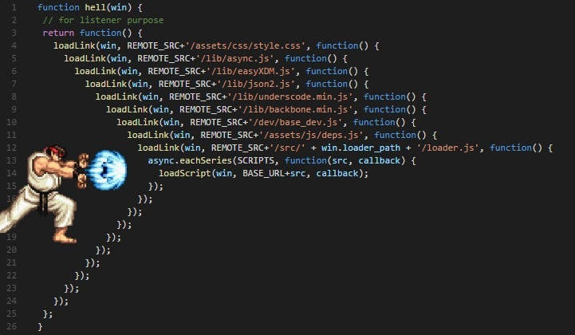
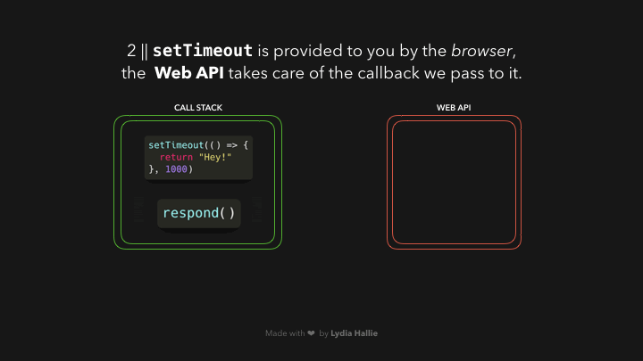

# Async Programming #


Technique that enables your program to start a potentially long-running task and still be able to be responsive to other events while that task runs, rather than having to wait until that task has finished. Once that task has finished, your program is presented with the result.

JavaScript is single-threaded: only one task can run at a time.


## Callback  ##

```javascript repl+

function respond() {
    console.log('Start');
    setTimeout(() => {
        console.log('Hey');
    }, 1000);
    console.log('End');
}

respond();

```

printed :
Start
End 
Hey after 1s 


The setTimeout is a JavaScript function that takes two parameters. The first parameter is callback function, and the second is the time after which that function should be executed in a second. 

Sometimes, developers have to make multiple calls to different sources in their code. In order to make these calls, callbacks are being nested until they become very hard to read or maintain. This is referred to as Callback Hell.



Luckily, we now got something called promises to help us out! 


Underline: 
EventLoop/WebApi/Queue:

https://dev.to/lydiahallie/javascript-visualized-event-loop-3dif
https://www.youtube.com/watch?v=8aGhZQkoFbQ&t=1352s

## Promise  ##

ES6 introduced Promises.

> “A promise is a placeholder for a value that can either resolve or reject at some time in the future”

Key Concepts of Promises
States:

Pending: Initial state, neither fulfilled nor rejected.
Fulfilled: Operation completed successfully.
Rejected: Operation failed.
Methods:

then(): Attaches callbacks for the fulfillment and rejection cases.
catch(): Attaches a callback for only the rejection case.
finally(): Attaches a callback that is invoked regardless of the promise's outcome.

Timout using promise 


```javascript repl+

const wait = function(ms){

return new Promise((resolve)=>{

  setTimeout(resolve, ms);

});
}
wait(1000).then(()=>{   //after 1s 'Hey'
  console.log('Hey');  
  });


```


In summary, Promises provide a powerful way to handle asynchronous operations in JavaScript, making the code more readable and easier to manage.


Read:
https://medium.com/@masterrajpatel/javascript-visualized-promises-async-await-%EF%B8%8F-c51af935f7f5





## Async   ##

ES7 introduced Async , new way to add async behavior in JavaScript and make working with promises easier! 
With the introduction of the async and await keywords, we can create async functions which implicitly return a promise

They allow you to write asynchronous code that looks and behaves more like synchronous code, making it easier to read and maintain.


async Function:

Declared with the async keyword.
Always returns a Promise.
The resolved value of the Promise is the value returned by the function.


await Expression:

Can only be used inside an async function.
Pauses the execution of the async function and waits for the Promise to resolve or reject.
Resumes execution and returns the resolved value of the Promise.


```javascript repl+

async function f() {
  return "1";
}

//return a promisefunction 
function f1() {
  return Promise.resolve("1");
}


async function g(){
let value = await f(); // wait until the promise resolves (*)
}

g();

```


Timeout using Async 


```javascript repl+

async function wait(ms) {

return new Promise((resolve)=>{

  setTimeout(resolve, ms);

});

}

async function foo() {
  await wait(1000);
  console.log('Hey');
}

foo();  ////after 1s 'Hey'


```

//Read
https://dev.to/lydiahallie/javascript-visualized-promises-async-await-5gke#asyncawait

https://gist.github.com/pqt/883216dfe290585ac4b839f8209949b7

https://javascript.info/async-await
https://www.w3schools.com/js/js_async.asp


[Back](https://github.com/parane/web-development/tree/javascript?tab=readme-ov-file#table-of-content)
