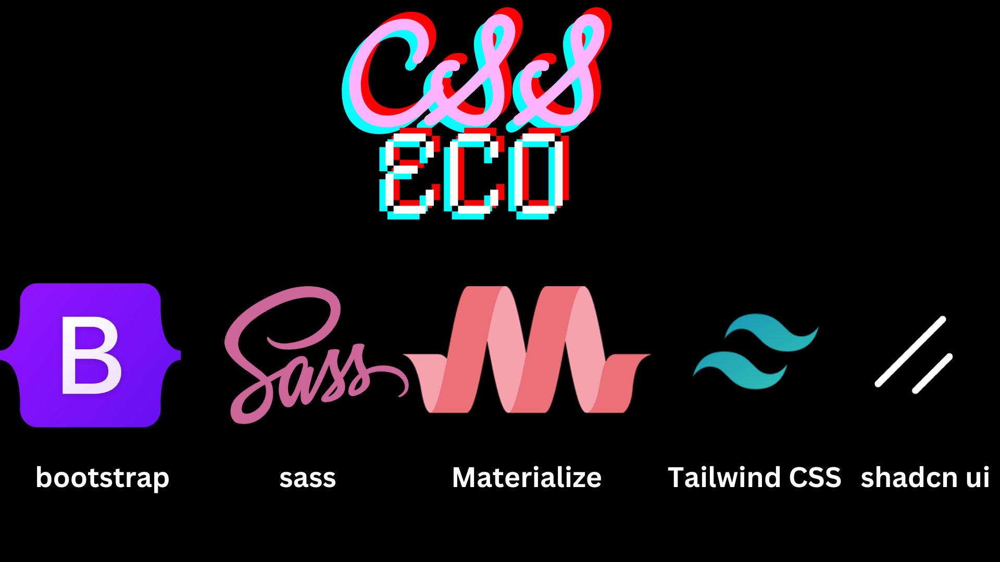
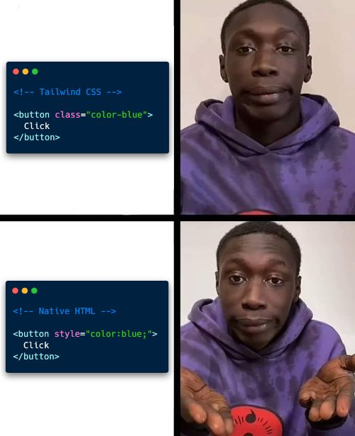
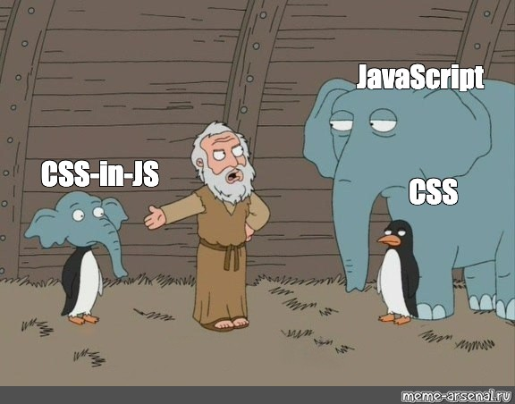

# CSS Eco System #

## CSS ##

CSS (Cascading Style Sheets)
Purpose: CSS is used to style and layout web pages, including the design, colors, and fonts. 
Key Features: 
Selectors: Target HTML elements to apply styles. 
Box Model: Defines the layout and spacing of elements. 
Flexbox and Grid: Modern layout systems for creating complex designs. 
Responsive Design: Media queries allow for different styles based on screen size. 
Animations and Transitions: Create dynamic effects and animations. 

## CSS Eco ##

Lets see some CSS libs for react/next js 

CSS libraries and preprocessors like Sass, Tailwind, Bootstrap, Materialize, and Shadcn exist to address different needs and preferences in web development. Here are some reasons why there are multiple CSS libraries:

## Sass (Syntactically Awesome Stylesheets)
- **Purpose**: A CSS preprocessor that adds features like variables, nested rules, and functions to CSS.
- **Key Features**:
    - **Variables**: Store reusable values.
    - **Nesting**: Nest CSS rules to reflect HTML structure.
    - **Mixins**: Reusable chunks of CSS.
    - **Functions**: Perform calculations and manipulate values.

## Tailwind CSS

- **Purpose**: A utility-first CSS framework for rapidly building custom designs.
- **Key Features**:
    - **Utility Classes**: Use predefined classes to style elements.
    - **Customization**: Highly configurable via a configuration file.
    - **Responsive Design**: Easily create responsive layouts.

## Bootstrap

- **Purpose**: A comprehensive CSS framework for building responsive, mobile-first websites.
- **Key Features**:
    - **Pre-styled Components**: Buttons, forms, modals, etc.
    - **Grid System**: Create responsive layouts with a flexible grid.
    - **JavaScript Plugins**: Interactive components like carousels and modals.

## Materialize
- **Purpose**: A CSS framework based on Google's Material Design guidelines.
- **Key Features**:
    - **Material Design**: Implements Google's Material Design guidelines.
    - **Responsive**: Built-in responsive design.
    - **Components**: Pre-styled components like cards, buttons, and forms.

## Shadcn
- **Purpose**: A modern CSS framework for Beautifully designed components that you can copy and paste into your apps.
- **Key Features**:
    - **Shadow DOM**: Encapsulates styles and markup.
    - **Custom Elements**: Define new HTML elements.
    - **Scoped Styles**: Styles are scoped to the component.

## Summary
- **Sass**: Enhances CSS with additional features for better maintainability and reusability.
- **Tailwind CSS**: Focuses on utility classes for rapid and custom design development.
- **Bootstrap**: Provides a complete set of pre-styled components and a grid system for quick development of responsive websites.
- **Materialize**: Implements Material Design principles for a consistent and modern look.
- **Shadcn**: Utilizes Shadow DOM for encapsulated and reusable components.

Each library or preprocessor has its own strengths and use cases, allowing developers to choose the best tool for their specific needs.

## CSS Modules ##
CSS Modules is a CSS file in which all class and animation names are scoped locally by default. This means that the styles defined in a CSS Module are scoped to the component they are imported into, preventing conflicts with other styles in the application.
Key Features
Scoped Styles: Styles are scoped to the component, preventing conflicts.
Dynamic Class Names: Class names are dynamically generated to ensure uniqueness.
Maintainability: Easier to maintain as styles are co-located with components.

Global Styles: Managing global styles can be more complex.
Tooling: Requires build tools like Webpack to process CSS Modules.
Dynamic Styling: Less flexible for dynamic styling compared to CSS-in-JS.

## CSS in JS ##

CSS-in-JS is a styling technique where CSS is written within JavaScript files. This approach allows for more dynamic and scoped styling, often used in modern JavaScript frameworks like React. Here are some key points:

Key Features
**Scoped Styles**: Styles are scoped to components, preventing conflicts.
**Dynamic Styling**: Styles can be dynamically generated based on component props or state.
**Theming**: Easy to implement theming by passing theme objects.
**Maintainability**: Styles are co-located with components, making it easier to maintai

Popular libraries include 
  1. styled component
  2. Emotion 

### Styled Components
The styled-component is popular library for styling react componets. It allows you to erite plain css with your js and attach it to componets

### Emotion 
Emotion is another popular library for styling react components. It provides powerful styling features like nested selectors, global styles, and theming.

We ll see more depth during react 

Issues:
Performance: Can introduce runtime performance overhead.
Tooling: Requires additional libraries and tooling.
Learning Curve: May have a steeper learning curve for developers familiar with traditional CSS.

https://www.reddit.com/r/reactjs/comments/sqxwlf/why_was_cssinjs_ever_a_thing/

