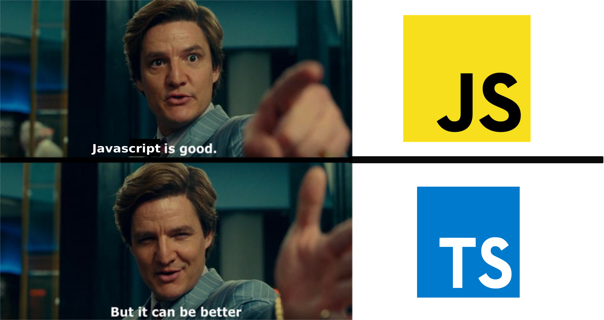

# TypeScript #


A superset of JavaScript that adds **static type** checking, which can help catch errors early during development (compile)
 
> static type: check at compile time rather than at runtime, 
> https://blog.logrocket.com/using-strongly-typed-vs-statically-typed-code/
> https://stackoverflow.com/questions/2690544/what-is-the-difference-between-a-strongly-typed-language-and-a-statically-typed


## What is typescript? ##

Typescript can be explained as a superset of JavaScript. It means that every JavaScript (also ES6 & newer versions)
code is valid Typescript code. 


## why use Typescript ? ##


**Static Type Checking:**
TypeScript adds static type checking to JavaScript, which helps catch errors early during development. By specifying types for variables, function parameters, and return values, developers can avoid many common runtime errors.

**Improved Code Readability and Maintainability:** 
Type annotations make the code more readable and self-documenting. This helps developers understand the codebase more quickly and makes it easier to maintain.

**Advanced Features:**
TypeScript includes advanced features such as interfaces, generics, and decorators, which are not available in plain JavaScript. These features enable developers to write more robust and reusable code.

## What are advance features ? ##

1. Data Types
2. Interfaces
3. Generics
4. Decorators

### TS Best Practises ###


#### Enable Strict Mode:  #### 
Use strict mode in tsconfig.json to enable all strict type-checking options.

#### Use unknown Instead of any:####
Prefer unknown over any for better type safety.

#### Avoid Using general Types (Object, Function): ####  
Use specific types or interfaces instead of the Object type.
avoid using the Function type
```typescript
function processFunction(fn: Function) {
    // TypeScript does not know the shape of `fn`, so it cannot provide type safety
    fn();
}
//use specific function type !

type GreetFunction = (name: string) => string;

const greet: GreetFunction = (name) => `Hello, ${name}`;

function processGreetFunction(fn: GreetFunction) {
    // TypeScript knows the shape of `fn`, so it can provide type safety
    console.log(fn("World"));
}

```

#### Immutability: readonly or const ####
Use readonly properties and parameters to enforce immutability.
Use as const to create immutable literals.

#### Narrow Types with Type Guards: ####

Use type guards to narrow down types in conditional blocks.

#### Use Partial, Required, Readonly, and Pick Utility Types: ####

Use these utility types to create new types based on existing ones.

https://github.com/andredesousa/typescript-best-practices

https://github.com/labs42io/clean-code-typescript


### References ###

https://www.typescriptlang.org/
