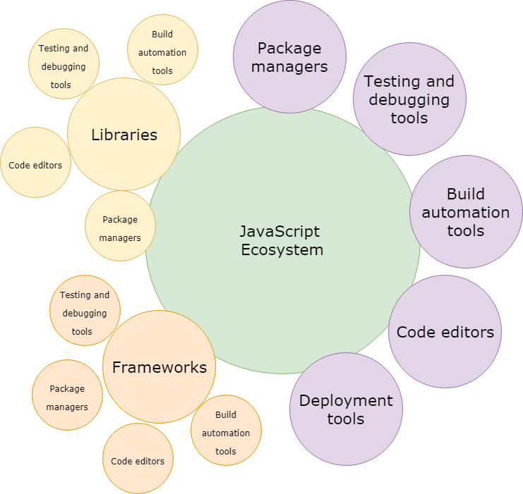
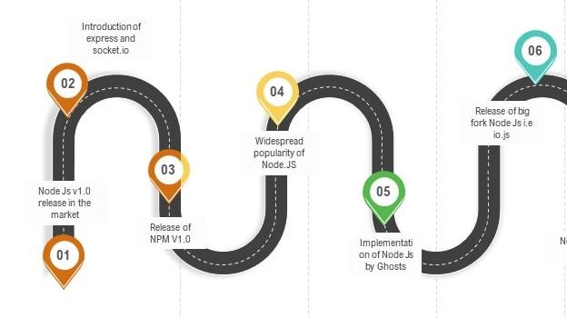
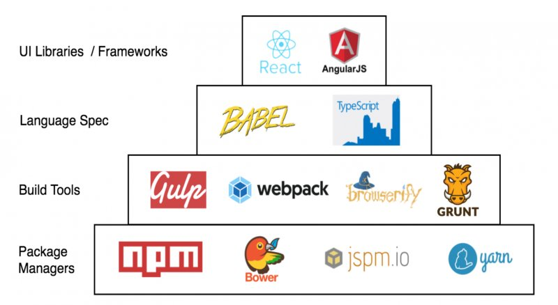
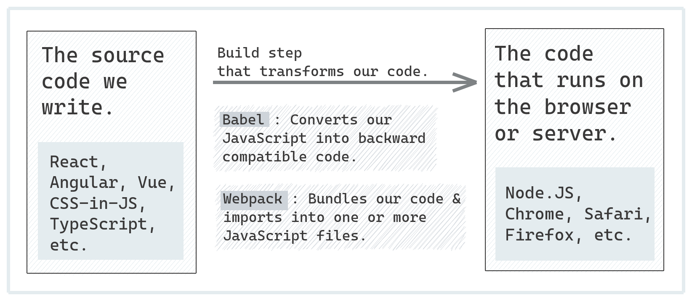
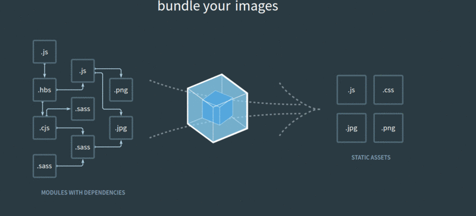
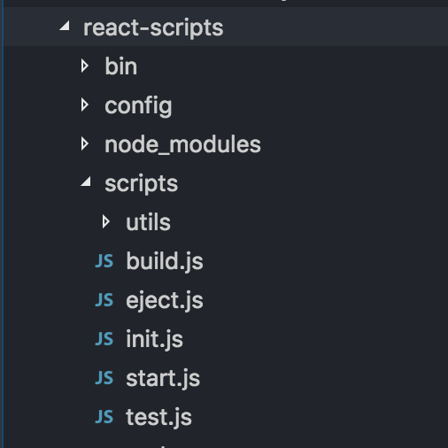

# Javascript Eco system #

## Nodejs ##

- JavaScript runtime environment
- runs on the V8 JavaScript engine
- executes JavaScript code outside a web browser.

## Frontend Tools ##

In modern web development, Node is increasingly used to run tools and services
depended on by front-end engineers. As a Node programmer, you may be responsible
for setting up and maintaining these tools. As a full-stack developer, you’ll want to use
these tools to create faster and more reliable web applications

https://www.linux.com/training-tutorials/modern-day-front-end-development-stack/

The benefits of using front-end build systems can be huge. They can help you to write
more readable and future-proof code. There’s no need to worry about ES2015 browser
support when you can transpile it with Babel. Also, because you can generate source
maps, browser-based debugging is still possible.

Recently, front-end and server-side developers have converged on using npm for
distributing JavaScript. That means npm is used for frontend modules, such as React,
and serverside code, such as next js.

### Package manager  ###
#### Npm ####
npm (Node Package Manager) is the default package manager for Node.js. It is used to manage and share JavaScript code by providing a repository for Node.js packages/modules. npm allows developers to install, share, and manage dependencies for their projects.

<pre>npm install express </pre>
<pre>npm uninstall express </pre>
<pre>npm publish </pre>

#### Script Running: ####
npm has built-in features for running scripts. Therefore, you can rely on your collaborators or users being able to invoke commands such as npm
start and npm test. To add your own command for npm start, you add it to the scripts property of your project’s package.json file

<pre>npm run build </pre>

#####  npm vs npx #####
npm: Primarily used for managing packages (installing, updating, removing) and running scripts defined in package.json.
npx: Used to execute binaries from node_modules or from a remote registry without globally installing them.
use case: Executes packages without installing them globally, useful for one-time use
npm:
Install a package: <pre>npm install <package-name></pre>
Run a script: <pre>npm run <script-name></pre>
npx:
Execute a package:   <pre>npx <package-name></pre>  <pre> npx shadcn@latest init </pre>
one time execution : <pre>npx create-react-app my-app </pre>

#### Yarn ####
Yarn is a package manager for JavaScript that helps manage project dependencies. It is an alternative to npm and offers several advantages, such as faster installation, deterministic dependency resolution, and better performance in certain scenarios.

### Front end build tool  ###

#### Transpiler - Babel ####
Babel is **transpilar** which are used to convert modern ecmascript  into more widely supported ES5 code.

https://babeljs.io/

#### Old Players Gulp and Grunt #### 
Gulp - A toolkit for automating time-consuming tasks in your development workflow (**Task Runner**). You can use npx to run Gulp tasks without installing Gulp globally. 
So modern web development  we are not really needed to use Gulp or Grunt.

#### Webpack ####

Webpack is a module bundler. Its main purpose is to bundle JavaScript files for usage in a browser, yet it is also capable of transforming, bundling, or packaging just about any resource or asset.

Webpack 5 features :
- Production Optimized Build
- Bundle Splitting
- Tree Shaking
- Code Chunking
- Hot Module Replacement (HMR) - Dev Server 

https://requestly.com/blog/introduction-to-webpack-top-5-features-of-webpack/

We are not directly working with webpack in modern web development , but we are using tools like CRA (create-react-app), vue-cli, and Angular CLI which are using webpack under the hood.

#### CRA  uses webpack underline for build ####
Create React App (CRA) is a command-line tool that helps developers quickly set up a new React project with a sensible default configuration. It abstracts away the complex configuration needed for a React application, allowing developers to focus on writing code.

Creating a New React App:  <pre>npx create-react-app my-app </pre>
Running the Development Server:  <pre>cd my-app npm start </pre>
Creating a Production Build:  <pre>npm run build -> react-scripts build</pre> 

if you build , it ll be uses webpack to bundle JavaScript, CSS, and other assets.
Build process:
Compiles: Transpiles modern JavaScript (ES6+) to ES5 using Babel.
Bundles: Uses Webpack to bundle JavaScript, CSS, and other assets.
Minifies: Minifies the JavaScript and CSS files to reduce file size.
Optimizes: Optimizes the build for performance, including tree-shaking to remove unused code.

#### Vite ####
Vite is the new player in the town, but the interesting fact is that it outperforms Webpack in terms of speed. It was developed by Evan You, creator of Vue.js.

A build tool that aims to provide a faster and leaner development experience for modern web projects.

https://dev.to/debajit13/vite-vs-webpack-a-comparative-analysis-851
https://ritza.co/articles/gen-articles/webpack-vs-babel-vs-rollup-vs-gulp-vs-parcel-vs-vite/

## Modern Javascript Libraries and Frameworks ##
JavaScript frameworks are an essential part of modern front-end web development, providing developers with tried and tested tools for building scalable, interactive web applications.

### SPA - Client side JS Frameworks/Library ###

Purpose: Building user interfaces and single-page applications.

But We only focus on React in our next sections. 

#### React ####
Developed By: Facebook
Type: Library
Key Features:
Component-Based: UI is built using reusable components.
Virtual DOM: Efficiently updates and renders components.
JSX: JavaScript syntax extension for writing HTML-like code within JavaScript.
Unidirectional Data Flow: Data flows in one direction, making it easier to understand and debug.

#### Vue ####
Developed By: Evan You
Type: Framework
Key Features:
Reactive Data Binding: Automatically updates the DOM when the data changes.
Component-Based: Similar to React, UI is built using reusable components.
Directives: Special tokens in the markup that bind to the DOM.
Vue CLI: Command-line interface for rapid project scaffolding.

#### Angular ####
Developed By: Google
Type: Framework
Purpose: Building large-scale, enterprise-level single-page applications.
Key Features:
Two-Way Data Binding: Synchronizes data between the model and the view.
Dependency Injection: Design pattern that makes it easier to manage and test components.
TypeScript: Uses TypeScript, a statically typed superset of JavaScript.
Comprehensive: Includes everything needed for a full-fledged application, such as routing, state management, and form handling.

### Server side JS Frameworks/Library ###

#### Next js ####

JavaScript frameworks are an essential part of modern front-end web development, providing developers with tried and tested tools for building scalable, interactive web applications.
Many modern companies use frameworks as a standard part of their tooling, so many front-end development jobs now require framework experience.

#### Express js ####

Fast, unopinionated, minimalist web framework for Node.js