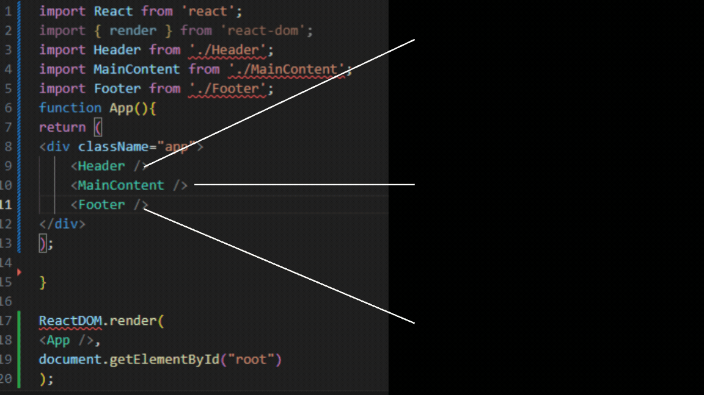
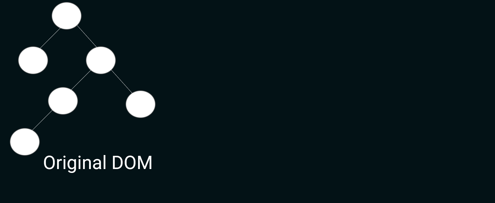
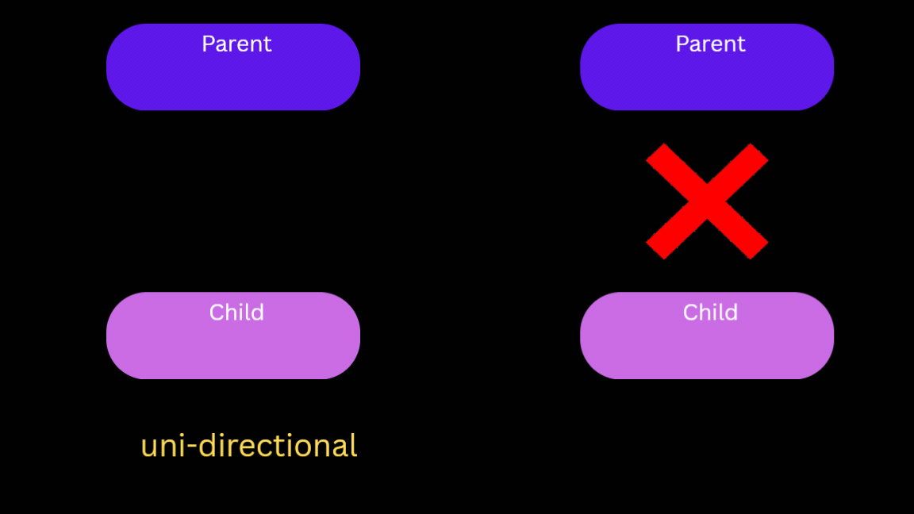

# React #
React.js is a JavaScript **library** for building **user interfaces**, primarily for **single-page applications**.
It allows developers to 
create **reusable UI components**, 
**manage the state** of those components, and 
efficiently update and render the right components when data changes.

https://www.youtube.com/watch?v=8pDqJVdNa44&pp=ygUQcmVhY3QganMgaGlzdG9yeQ%3D%3D

### Key Features of React.js

- **1. Component-Based**: Build encapsulated components that manage their own state, then compose them to make complex UIs.
- **2. Declarative**: Design simple views for each state in your application, and React will efficiently update and render just the right components when your data changes.
- **3. Virtual DOM**: React uses a virtual DOM to optimize updates and rendering, making it faster than direct DOM manipulation.
- **4. Unidirectional Data Flow**: Data flows in one direction, making it easier to understand and debug.

## SPA - Single Page Application ##

A Single Page Application (SPA) is a web application that interacts with the user by dynamically rewriting the current page rather than loading entire new pages from the server. 
This approach provides a more fluid user experience, similar to a desktop application. 

Frameworks/Libraries: React, Angular, Vue.js
Routing Libraries: React Router, Vue Router

### Real world Analogy ###

Party Photo Frame Analogy: Imagine a photo frame where you can change the people faces without changing the frame itself.
Frame: The frame represents the main structure of the application, which remains constant.
People: The people represent different views or content that can be dynamically loaded into the frame.

## 1. components in React 

Components are the building blocks of a React application.  Components are independent and reusable bits of code. They
serve the same purpose as JavaScript functions  but work in isolation and return HTML. 

Components are created via a function or class.

So when consider earlier example
The frame is like the main component of a React application that stays the same.
The people are like the child components that can change based on the application's state or user interactions.

React uses a component architecture for building user interfaces and organizing code. 

>We can see here a few components in use. <Header />,
<MainContent /> and <Footer /> are all components. The
App() function is a component as well and we can see on the last
line of this example how we can use the ReactDOM library and the
ReactDOM.render() method to manage adding the UI we build to
a webpage.

## 2. Decleartive 

React is an abstraction, so the costs of it being an abstraction still remain. You don’t get
as much visibility into the system you’re using because it’s built in a particular way and
exposed through an API. This also means you’ll need to build your UI in an
idiomatically React way. Fortunately, React’s APIs provide “escape hatches” that let you
drop down into lower levels of abstraction. You can still use other tools like jQuery, but
you’ll need to use them in a React-compatible way.

One of the main ways it does that is by encouraging you to be declarative instead of
imperative. You get to declare how your components should behave and look under
different states, and React’s internal machinery handles the complexity of managing
updates, updating the UI to reflect changes, and so on.

## 3. Virtual Dom

It is a lightweight, in-memory representation of the real DOM. When the state of an application changes, the VDOM is updated first, and then it is compared with the previous version of the VDOM. This process is called "reconciliation."

Performance is a key feature of React, but it’s secondary to simplicity. The virtual DOM is part of what enables you to
defer thinking about complicated state logic and focus on other, more important parts of your application.

## 4. Unidirectional Data Flow

A unidirectional data flow means that when designing a React app you often nest child components within higher-order parent components. 

**Predictability:** Easier to understand how data changes affect the application.
**Easier State Management:** Single source of truth, usually the parent component.
**Improved Performance:** More efficient rendering.
**Simplified Data Flow:** Reduces complexity.
**Consistency:** Ensures data consistency across the application.

> Two-way binding and bidirectional data flow are often used interchangeably, but they can have slightly different connotations depending on the context.
> Two-way binding refers to a data binding technique where changes in the UI automatically update the model, and changes in the model automatically update the UI.
