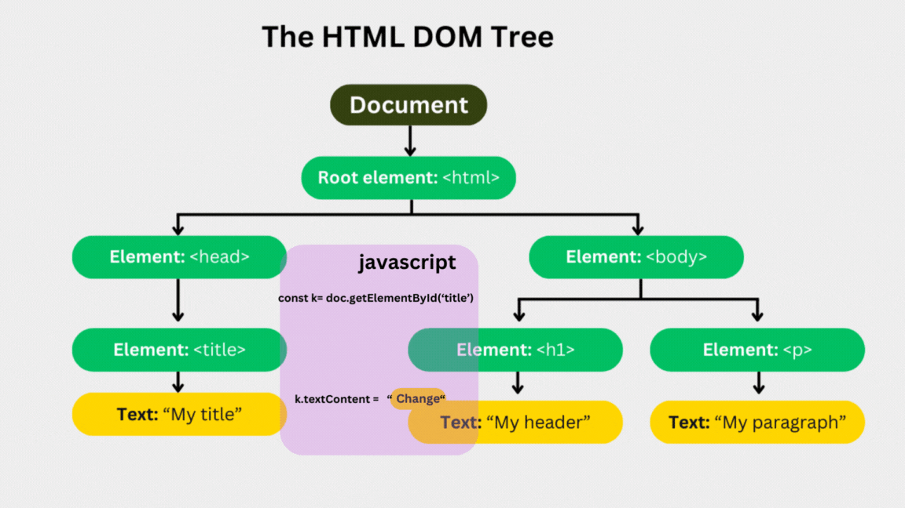
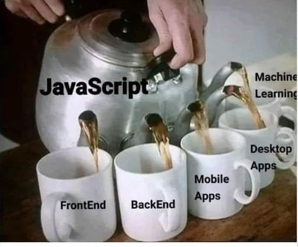
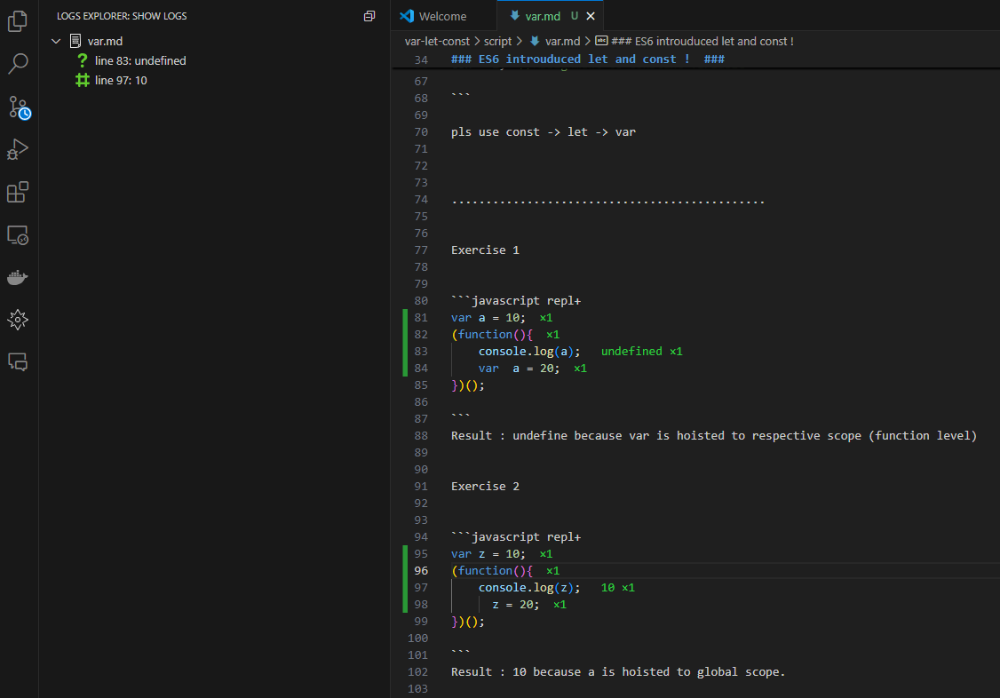

# Javascript #  

JavaScript is a  high-level programming language primarily used for web development. 

JavaScript is often used to manipulate the DOM to create dynamic and interactive web pages




# Advance Javascript #

JavaScript is now evolve to a full-fledged programming language which can be used for game development , 
server side development and even for machine learning.



Unlike other language, Javascript doesnt have the luxury to deprecate feature. 
Specially in front end which is need to be rendered in all kind of browser.

So changes in javascript comes in three flavour : alternative, addition and advance.

Advance JavaScript [version](https://www.w3schools.com/js/js_versions.asp) is the most popular 👉 implementation of the ECMAScript Standard.

ES5 = ECMAScript 2009
ES6 = ECMAScript 2015
ECMAScript 2016
.
.
ECMAScript 2024

So, lets explore JavaScript Features You Need to Know to master in React Js. 

# Running Javascript #
If you are developing for the back end using Javascript , you may better control of version of the runtime define you use
But for front end , you have to consider the browser compatibility. We used transpiling tools like Babel to convert the latest javascript to older version.

### 1. Run using Node ###

```cmd
node hello.js 
```

### 2. Run using Code Runner plugin ###

By right click and run it in the editor. 

### 3. Run using REPL (real-eval-print-loop ) ###

I have used [visual Studio plugin](https://marketplace.visualstudio.com/items?itemName=achil.vscode-javascript-repl) 
for running script folder's code snippet.



### 4. Run in Browser ###

you may View > Developer > javascript console to run the javascript code in browser


## Concept ##

1. [var-let-const](https://github.com/parane/web-development/tree/javascript/var-let-const)
2. [function-arrow-fn](https://github.com/parane/web-development/tree/javascript/function)
3. [oop](https://github.com/parane/web-development/tree/javascript/oop)
4. [literal-destructuring](https://github.com/parane/web-development/tree/javascript/literals-destructuring)
5. [module](https://github.com/parane/web-development/tree/javascript/module)
6.[suprises](https://github.com/parane/web-development/tree/javascript/literals-destructuring)


## Reference ##
[book]javascript the good parts
[book]Rediscovering JavaScript
[javascript-react](https://kinsta.com/blog/javascript-react/)
