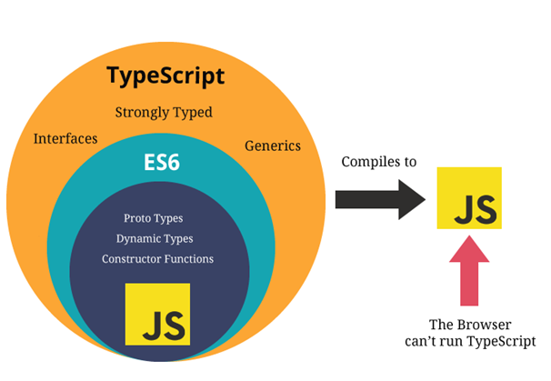

# TypeScript #

A superset of JavaScript that adds static type checking, which can help catch errors early during development

## What is typescript? ##

Typescript can be explained as a superset of JavaScript. It means that every JavaScript (also ES6 & newer versions)
code is valid Typescript code. 

## why use Typescript ? ##

**Static Type Checking:**
TypeScript adds static type checking to JavaScript, which helps catch errors early during development. By specifying types for variables, function parameters, and return values, developers can avoid many common runtime errors.

**Improved Code Readability and Maintainability:** 
Type annotations make the code more readable and self-documenting. This helps developers understand the codebase more quickly and makes it easier to maintain.

**Advanced Features:**
TypeScript includes advanced features such as interfaces, generics, and decorators, which are not available in plain JavaScript. These features enable developers to write more robust and reusable code.

## What are advance features ? ##

1. Data Types
2. Interfaces
3. Generics
4. Decorators