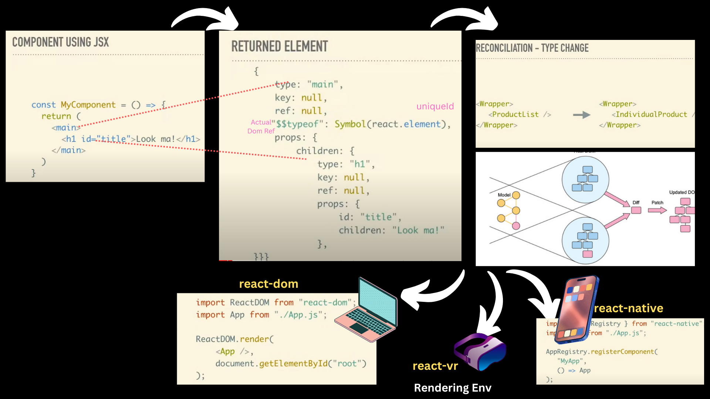

# Components #

— Encapsulated units of functionality that are the fundamental unit of React. These are what your views are made from. They’re JavaScript functions or classes that receive properties as inputs and maintain their own internal state. React  provides a set of lifecycle methods for certain types of components so you can hook into the different component management steps.



## Types of Componets ##

1. **Functional Components** - These are simple JavaScript functions that take in props and return a React element
```jsx
const greeting = (props) => {
  return <h1>Hello, {props.name}!</h1>;
};

```

2. **Class Components** - These are ES6 classes that extend from React.Component. They must include the render method, and the return value from this method is displayed on the screen. 
> recommend defining components as functions instead of classes.
```jsx
class Greeting extends Component {
  render() {
    return <h1>Hello, {this.props.name}!</h1>;
  }
}

```