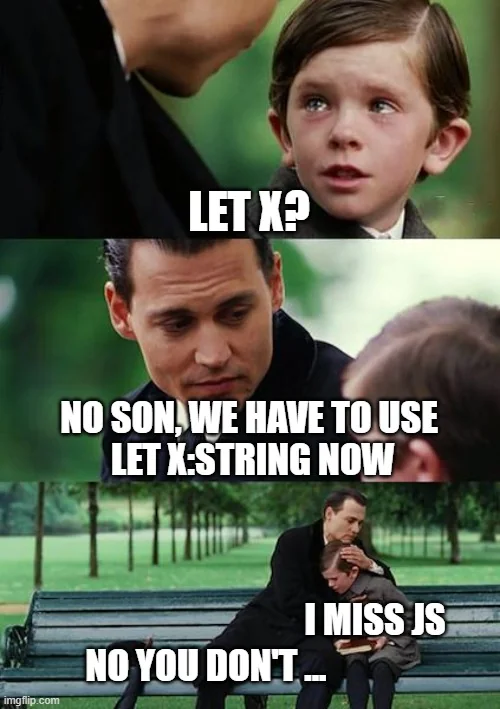
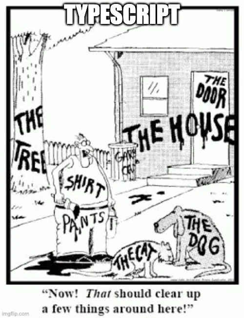
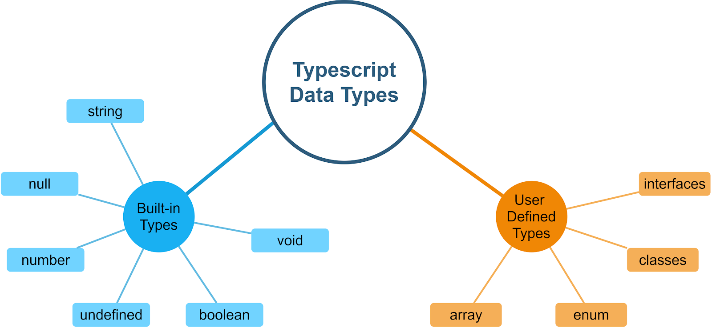

# Data Type #


The TypeScript language supports different types of values. It provides data types for the JavaScript to transform it into a strongly typed programing language.

The Type System checks the validity of the given values before the program uses them. It ensures that the code behaves as expected

## What are types ? ##


In TypeScript, we can specify the type of a variable using a colon (:) followed by the type.



### Built-in Types ###
Built-in types are predefined types provided by TypeScript to represent common data structures and values. 

These include:

**Boolean:** Represents true or false values.  <pre>let isDone: boolean = false; </pre>
**Number:** Represents both integer and floating-point numbers.  <pre>let age: number = 30; </pre>
**String:** Represents text data.  <pre>let name: string = "John"; </pre>
**Array:** Represents a collection of values of a specific type.  <pre>let list: number[] = [1, 2, 3]; </pre>
**Tuple:** Represents an array with a fixed number of elements of specific types.  <pre>let tuple: [string, number]; tuple = ["hello", 10]; </pre>
**Enum:** Represents a collection of related values that can be numeric or string-based.  <pre>enum Color {Red, Green, Blue} let c: Color = Color.Green; </pre>
**Any:** Represents any type, useful when the type is not known during development.  <pre>let notSure: any = 4; notSure = "maybe a string instead"; notSure = false; </pre>


Refer: TypeAssertions 

**Void:** Represents the absence of any type, commonly used as the return type of functions that do not return a value.  <pre>function warnUser(): void { console.log("This is a warning message"); } </pre>
**Null and Undefined:** treats null and undefined not just as values but as types. <pre>let u: undefined = undefined; let n: null = null; </pre>
This encourages developers to actively consider and handle these cases, significantly reducing the risk of runtime errors related to null or undefined values.

To allow a variable to hold either a specific type of value or null/undefined, TypeScript uses union types:
```typescript
let optionalName: string | null = null; // Can be a string or null
let maybeAge: number | undefined; // Can be a number or undefined
```
>As a note: we encourage the use of strictNullChecks when possible

**Never:** Represents the type of values that never occur, such as functions that always throw an error or never return.
**Object:** Represents non-primitive types.<pre>let obj: object = { name: "John", age: 30 }; </pre>

https://www.typescriptlang.org/docs/handbook/basic-types.html


### User-Defined  ###
User-defined types are custom types created by developers to represent specific structures or behaviors in their applications. 

Classes: Define a blueprint for creating objects with specific properties and methods.  
```typescript repl+
class Car { 
make: string; model: string; 
year: number; 
constructor(make: string, model: string, year: number){ 
this.make = make; 
this.model = model; 
this.year = year; 
} 
} 
let bmw: Car;
```

Enums: Define a set of named constants.  <pre>enum Direction { Up, Down, Left, Right } </pre>
Interfaces: Refer: 


```typescript repl+

class Car {
    make: string;
    constructor(make: string) {
        this.make = make;
    }
}

let myCar = new Car("Toyota");

console.log(myCar instanceof Car); 

let age: number = 30

console.log(typeof age);

```

## Type Inference ##
Type inference is a feature in TypeScript where the compiler automatically determines the type of a variable based on the value assigned to it. This allows developers to omit explicit type annotations while still benefiting from type safety.

```typescript
let num = 42; // no need to tell me !!! TypeScript infers the type as number :D
let greeting = "Hello"; // TypeScript infers the type as string
num = "Not number"; // Error !
```

## Type Assertions  ##

Type assertions are a way to tell the TypeScript compiler to treat a value as a specific type. This can be useful when you know more about the type of a value than TypeScript does. There are two syntaxes for type assertions: 

1. Angle-bracket syntax:  
```typescript
let code: any = 123;
let employeeCode = <number> code;
console.log(typeof(employeeCode)); //Output: number
```

2. as syntax: 

```typescript
let code: any = 123;
let employeeCode = code as number;
console.log(typeof(employeeCode)); //Output: number
```

>The as syntax is generally preferred in modern TypeScript code, especially when working with JSX in React. confused in html !


## Optional Type ##

In TypeScript, optional types can be represented using union types or by using the ? syntax in function parameters and object properties.

```typescript
function greet(name?: string) {
    if (name) {
        console.log(`Hello, ${name}`);
    } else {
        console.log("Hello, Guest");
    }
}
```
> you could use default 

## Type Guards ##

Type guards are a way to narrow down the type of a variable within a conditional block.

We can use instanceof vs typeof in TypeScript : 

**instanceOf** : Used to check if an object is an instance of a specific class or constructor function. Works with custom classes and built-in objects.

**typeof** Works with primitive types and functions.
