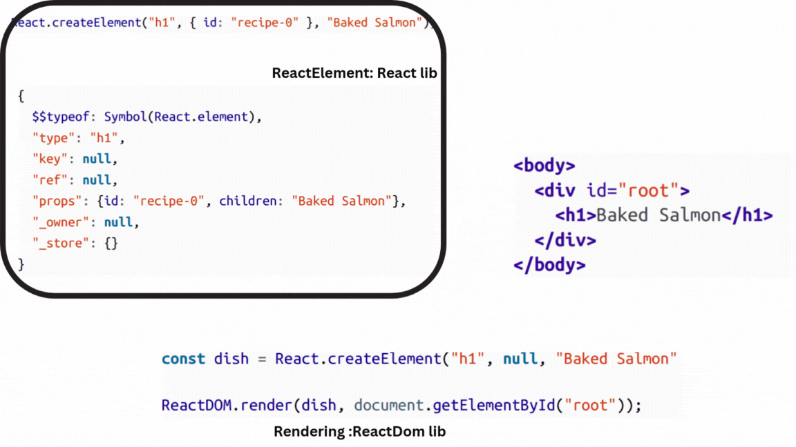

# React Elements #

HTML is simply a set of instructions that a browser follows when
constructing the DOM. The elements that make up an HTML
document become DOM elements when the browser loads HTML and
renders the user interface.

The DOM API is a collection of objects that JavaScript can use to
interact with the browser to modify the DOM. If you’ve used
document.createElement or document.appendChild, you’ve
worked with the DOM API

React is a library that’s designed to update the browser DOM for us.
We no longer have to be concerned with the complexities associated
with building high-performing SPAs because React can do that for us.


With React, we do not interact with the DOM API directly. Instead, we
provide instructions for what we want React to build, and React will
take care of rendering and reconciling the elements we’ve instructed it
to create.

## 1. Creating React elements ##

React element is a light, stateless, immutable primitive in React. 

React elements are used to construct components, which in turn define the structure and behavior of the user interface.

There are two types: ReactComponentElement and ReactDOMElement. ReactDOMElements are virtual
representations of DOM elements

```jsx
React.createElement('h1', { className: 'greeting' }, 'Hello, world!')   
```
first arg : the type of element to create <h1>
second arg : the properties of the element { className: 'greeting' }
third arg : the children(s) of the element 'Hello, world!'

## 2. Rendering React Elements ##

During rendering , React will convert react element to an actual Dom element 

```html
<h1 class="greeting">Hello, world!</h1>
```

The properties are similarly applied to the new DOM element: the
properties are added to the tag as attributes, and the child text is added
as text within the element. 


A React element is just a JavaScript literal that tells React how to construct the DOM element.


## Creation and Rendering ##


