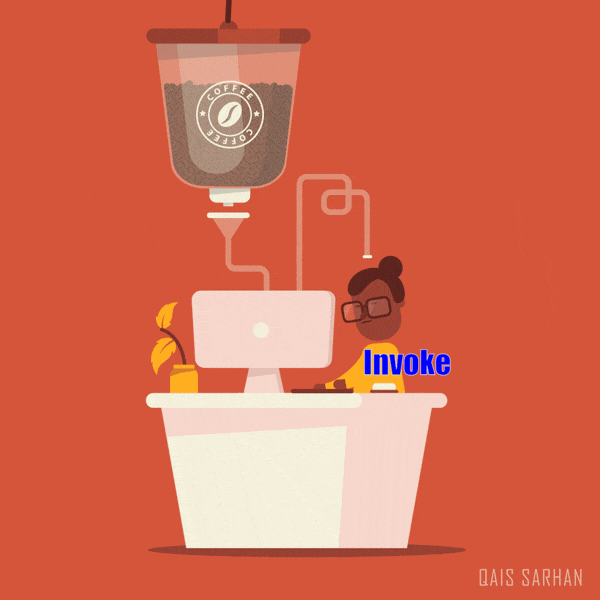

# Function #

Function is block of code define to perform a particular task.
They are  used for code reuse, information hiding, and composition.
Functions in JavaScript are first class objects.
- Define a function named greet.
- Assign the function to a variable sayHello.
- Pass the function as an argument to another function executeFunction.
- Return a function from another function createFunction.
- Add a property and **method** (like in Object) to the function.


The thing that is special about functions (from Object ) is that they can be **invoked**.

```javascript repl+
// Define a function named 'greet'
function greet(name) {
    console.log('Hello, ' + name + '!');
}

// Assign the function to a variable
const sayHello = greet;

// Pass the function as an argument to another function
function executeFunction(fn, value) {
    fn(value);
}
executeFunction(sayHello, 'Alice');

// Return a function from another function
function createFunction() {
    return function(name) {
        console.log('Hi, ' + name + '!');
    };
}
const newFunction = createFunction();
newFunction('Bob');

// Add a property to the function
greet.description = 'This function greets a person by name.';
console.log(greet.description);

```


### Function vs Method ###

Function and method are two terms that are often used interchangeably in JavaScript.


*** But, Methods have a “receiver” while functions do not. ***

What's that ? 

Function
A function is a standalone block of code designed to perform a particular task. It is not associated with any object.  
Method
A method is a function that is associated with an object. It is a property of the object and can access and manipulate the object's data.

Say Function is like general Receipt and Method is like a Receipt of specific shop like a KFC.

```javascript repl+
// Define a standalone function to print a generic receipt
function printReceipt(order) {
    console.log('Generic Receipt:');
}

// Define an object with a method to print a KFC-specific receipt
const kfc = {
    items: ['Chicken', 'Fries', 'Drink']
    printReceipt: function() {
        console.log('KFC Receipt:');
    }
};

printReceipt(order);
// Using the method to print a KFC-specific receipt
kfcOrder.printReceipt();

```

## Function Invocation ##



Function invocation is the process of calling a function. Every function receives two additional parameters: ** this ** and
** arguments **. The this parameter is very important in object oriented programming, and its value is determined by the invocation pattern


There are four pattern(way) to invoke a function in JavaScript:

1. Direct Function Invocation

```javascript repl+

function greet(name) {
    console.log('Hello, ' + name + '!');
}

// 1. Direct invocation
greet('Alice');
```

2. Method Invocation

A method is a function that is a property of an object.Every function receives two additional parameters: this and
arguments
When a function is invoked as a method of an object, the function's **this** keyword is bound to the object.


```javascript repl+
const person = {
   name: 'Charlie',
   greet: function (name) {
       console.log('Hello, ' + name + '!');
   }
   };
   person.greet(person.name);
```


3. Constructor Invocation 

new keyword is used to create an instance of a function. 
When a function is invoked with the new keyword, it is called a constructor function.

```javascript repl+
function Person(name) {
    this.name = name;
    this.greet = function() {
        console.log('Hello, ' + this.name + '!');
    };
}
const dave = new Person('Dave');
dave.greet();
```

4. call/apply Invocation

A JavaScript function has both call and apply methods available through its prototype.

```javascript repl+
function greet(name) {
    console.log('Hello, ' + name + '!');
}
greet.call(null, 'Eve'); //this-> null , argument -> list
greet.apply(null, ['Eve']); //this->null , argument -> array
```

**Wait ! We have some issue in Function arguments  **

### Function Arguments ###

Function arguments are the values that are passed to a function when it is invoked. We can pass any number of arguments to a function even if we define named parameter in function definition.


```javascript repl+
const max = function(a,b){
    return a > b ? a : b;
}

console.log(max(1,2));
console.log(max(1,2,3)); //Still we can invoke 
```

Traditionally, the special arguments keywords is used to process the parameter.It gives the
function access to all of the arguments that were supplied with the invocation. 

```javascript repl+
const max = function (){
    console.log(arguments instanceof  Array); //false, like array not array 
    let result = arguments[0];
    for(let i=1;i<arguments.length;i++){
        if(arguments[i] > result){
            result = arguments[i];
        }
    }
    return result;
}

console.log(max(1,2,3,4));
```

Even we solve some aspect of issue , but there are many issue with arguments. 
- It is not an array, so we can't use array methods like map, filter, reduce, etc.
- method signature is not clear, so it is hard to understand what arguments are expected by the function.


argument is beyond repair since Javascript ! 

So latest version of Javascript introduce different way to mitigate argument issues !

- We may use shorter syntax arrow function to avoid argument issue.Arrow functions do not have their own arguments object

```javascript repl+
const add = (a,b)=>{
    console.log(arguments); //cannot get argument params
    return a+b;
}
console.log(add(1,2));
```

Arrow Function solve more than argument, it solve another default parameter this (Dynamic/Static Scoping) ! 

we may play with [Arrow_Function](https://github.com/parane/web-development/blob/javascript/function/script/arrowfn.md)


- How about normal function ?  we may use  **Rest Parameter** and **Spread Operator** to solve this issue.

### Rest Parameter ###

The rest parameter syntax allows a function to accept an indefinite number of arguments as an array.

```javascript repl+

const max = function(...args){
    console.log(args instanceof Array); //True
    return args.reduce((max, value) => value > max ? value : max, args[0]);
}

```

### Spread Operator ###


The spread operator looks the same as the symbol {...} used for rest parameters, but it is used in a different context.
it appears on the calling side of a function invocation, where it is used to spread an array into individual arguments.

```javascript repl+
const max = function(...args){
    console.log(args instanceof Array); //True
    return args.reduce((max, value) => value > max ? value : max, args[0]);
}

const numbers = [1, 2, 3, 4, 5];
console.log(max(...numbers)); //5
```

Not only Array ! We can extend to Object also 

```javascript repl+

const person = {
    name: 'Alice',
    age: 30
};

console.log({...person,age: 31}); //{ age: 31, name: 'Alice' }

```

In some case when we are using rest param and spread operator , we may get undefine or null value.
So mitigate this one we can use default param. 

### Default Parameter ###

Default parameters allow you to specify default values for function parameters.

```javascript repl+
  const file = function(name, size = 0) {
    console.log(name, size);
  };
```


