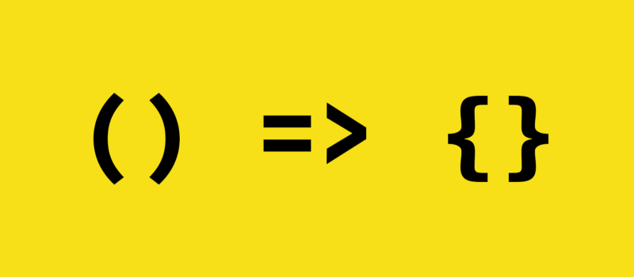

# Arrow function #

Arrow functions are a more concise way to write functions in JavaScript.
They are written using:

Arrow functions are anonymous and change the way `this` is handled in functions.


Dont confuse with Anonymous function which has been in javascript from day one. Arrow function is new 

Function can be define three ways
1. 
```javascript
function add(a, b) {
    return a + b;
}
```
2. Anonymous function , stored into variable
```javascript
const add = function(a, b) {
    return a + b;
}
```

3. Arrow function

```javascript

const add = (a, b) => a + b;
```

## Arrow vs Anonymous ##


## when to use Arrow ##