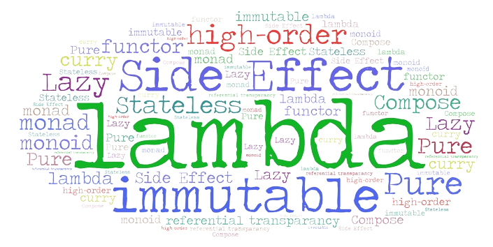
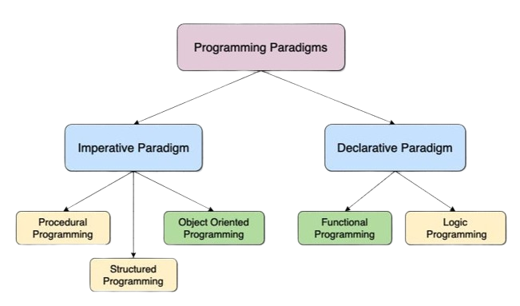

# Functional Programming #



### What is fn Programming ? ###
Functional programming is a programming paradigm. 

### what is programming paradigm ? ###

A programming paradigm is a fundamental style or approach(mindset) to programming that is based on certain principles and concepts. 




Imperative : follow my commands do this , then that 
  OOP: organise code into Object, keep state (data)  to yourself interact (method) to other object

Declarative : this is what i want , I dont care how you do it 
   functional programming: Treats computation as the evaluation of mathematical functions and avoids changing state and mutable data (i.e Pure Function).

### what is Pure function ? ###

Only input in ! only output out !, no side effect.
=> Always produce the same output for the same input

```javascript repl+
//Impure function , change the state (console.log)
function add(a,b){
    console.log(a+b);
    return a+b;
}

//Pure function 

function add(a,b){
    return a+b;
}


```


### what is Side Effect (Mutable) ? ###

A side effect in programming refers to any operation that modifies some state or interacts with the outside world beyond returning a value

### what is benefit from no Side Effect (immutable) ? ###

-Predictability 
-Debugging is easier
-Thread Safe
-Reusable function 


### What is Higher Order Function ? ###