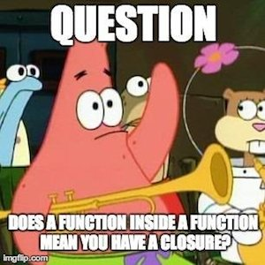

# Functional Programming #


### What is fn Programming ? ###
Functional programming is a programming paradigm. 

### what is programming paradigm ? ###

A programming paradigm is a fundamental style or approach(mindset) to programming that is based on certain principles and concepts. 


**Imperative** : follow my commands do this , then that. like order in subway 
> **OOP**: organise code into Object, keep state (data)  to yourself interact (method) to other object

**Declarative** : this is what i want , I dont care how you do it. like order in MAC.
> **functional programming**: Treats computation as the evaluation of mathematical functions and avoids changing state and mutable data (i.e Pure Function).


eg:
```javascript repl+
// Given Array and get double it and give me ?

//1. Imperative 
const numbers = [1, 2, 3, 4];
const doubled = [];
//iterate each array elements and double each elment and store it .....
for (let i = 0; i < numbers.length; i++) {
    doubled.push(numbers[i] * 2);
}
console.log(doubled); // [2, 4, 6, 8]

//2. Declarative approach
const doubledNumbers = numbers.map(num => num * 2);
console.log(doubledNumbers); // [2, 4, 6, 8]

```


### what is Pure function ? ###

Only input in ! only output out !, no side effect.
=> Always produce the same output for the same input

```javascript repl+
//Impure function , change the state (console.log)
function add(a,b){
    console.log(a+b);
    return a+b;
}

//Pure function 

function add(a,b){
    return a+b;
}


```


### what is Side Effect (Mutable) ? ###

A side effect in programming refers to any operation that modifies some state or interacts with the outside world beyond returning a value


### what is benefit from no Side Effect (immutable) ? ###

-Predictability 

-Debugging is easier

-Thread Safe

-Modularity /Reusable function 


### What is Higher Order Function ? ###

A higher-order function is a function that either takes one or more functions as arguments or returns a function as its result.


```javascript repl+
// take function as argument
function calculate(a, b, operation){
    return operation(a,b);
}

function add(a,b){
 return a+b;
}

function multiply(a,b){
 return a*b;
}

console.log(calculate(1,2,add)); //3
console.log(calculate(1,2,multiply)); //2


```

```javascript repl+
// return function 
//createLogger is high order function, which return function
function createLogger(level) {
    return function(message) {
        console.log(`[${level}] ${message}`);
    };
}

// Create different loggers
const infoLogger = createLogger('INFO');  // infoLogger is function which take message argument !
const errorLogger = createLogger('ERROR');

infoLogger('This is an informational message.');  // passing message: [INFO] This is an informational message.  

// processUserInput is high order function , which take function as argument , 
// function log based on user input  
function processUserInput(input, callback) {
    if (input === 'error') {
        callback('An error occurred.');
    } else {
        callback('Processing input: ' + input);
    }
}

// Using the loggers as callbacks
processUserInput('test', infoLogger); //'[INFO] Processing input: test' 

processUserInput('error', errorLogger); // '[ERROR] An error occurred.'


```

### Famous Higher Order Function in JS ###


**1.map()**

Applies a function to each element in an array and returns a new array with the results.

```javascript repl+
const numbers = [1, 2, 3, 4];
const doubled = numbers.map(num => num * 2);
console.log(doubled); // [2, 4, 6, 8]
```

**2.filter()**

Creates a new array with all elements that pass the test implemented by the provided function.

```javascript repl+
const numbers2 = [1, 2, 3, 4];
const evenNumbers = numbers2.filter(num => num % 2 === 0);
console.log(evenNumbers); // [2, 4]
```

**3.reduce()**

Executes a reducer function on each element of the array, resulting in a single output value.

```javascript repl+
const numbers4 = [1, 2, 3, 4];
const sum = numbers4.reduce((acc, num) => acc + num, 0);
console.log(sum); // 10
```

**4. forEach()**

Executes a provided function once for each array element.

```javascript repl+
const numbers3 = [1, 2, 3, 4];
numbers3.forEach(num => console.log(num));
```


### Functional Composition ###

Function composition is the process of combining two or more functions to produce a new function.

We can use [Arrow Function](https://github.com/parane/web-development/blob/javascript/function/script/arrowfn.md)
composition - a series of transformation - to make the code expressive and easier to maintain.

```javascript repl+
const add = (a,b)=> (a+b);
const mulitply = (a,b) => (a*b);
//(1+2)*3

const addThenMultiply = mulitply(add(1,2),3);
console.log(addThenMultiply); //9

```

### Recursion ###


Function call iteself 


```javascript repl+
function factorial(n) {
    if (n === 0) {
        return 1;
    }
    return n * factorial(n - 1);
}

console.log(factorial(5)); // 120

```

### Closure ###

Define a function that returns another function.



Nope, The returned function has access to the variables in the outer function's scope, even after the outer function has finished executing.

```javascript repl+

// Outer function
function createCounter() {
    let count = 0; // Variable in the outer function's scope

    // Inner function (closure)
    return function() {
        count++; // Accessing and modifying the outer function's variable
        return count;
    };
}

// Create a counter instance
const counter = createCounter();

console.log(counter()); // Output: 1
console.log(counter()); // Output: 2
console.log(counter()); // Output: 3
```

### Practical use - Closure ###

Kind of encapsulation ? - This has obvious parallels to object-oriented programming, where objects allow you to associate data (the object's properties) with one or more methods.

you can use a closure anywhere that you might normally use an object with only a single method.

**1 Private Variable**

```javascript repl+
// Function to create an object with private variables
function createPerson(name) {
    let age = 0;
    return {
        getName: function() {
            return name;
        },
        getAge: function() {
            return age;
        },
        setAge: function(newAge) {
            if (newAge > age) {
                age = newAge;
            }
        }
    };
}

const person = createPerson('Alice');
console.log(person.getName()); // Alice
console.log(person.getAge()); // 0
person.setAge(25);
console.log(person.getAge()); // 25

```

**2 Event handler**

```javascript repl+

// Event handler using closure
function createClickHandler(message) {
    //handler 
    return function() {
        alert(message);
    };
}

//crate a button element 
const button = document.createElement('button');
button.textContent = 'Click me';
//attach event hadler to the button 
button.onclick = createClickHandler('Button clicked!');
//Appen the button to the document body 
document.body.appendChild(button);

//when button click , alert will be trigger 

```

**3 Function factory**


```javascript repl+

// Function factory using closure
function createMultiplier(multiplier) {
    return function(value) {
        return value * multiplier;
    };
}

const double = createMultiplier(2);
const triple = createMultiplier(3);

console.log(double(5)); // 10
console.log(triple(5)); // 15
```

**4 React State management with hooks , especially with useState and useEffect**


```javascript repl+

import { useState } from 'react';

function Counter() {
    const [count, setCount] = useState(0);

    const clickHandler = function() {
        setCount(count + 1);
    }

    return (
        <div>
            <p>Count: {count}</p>
            <button onClick={clickHander}>Increment</button>
        </div>
    );
}

export default Counter;

```

In this example , the clickHandler inner function is serves as a closure, encapsulating the count in counter functional component 
and updating it when the button click.


lets more dive hooks into this in React section ! 