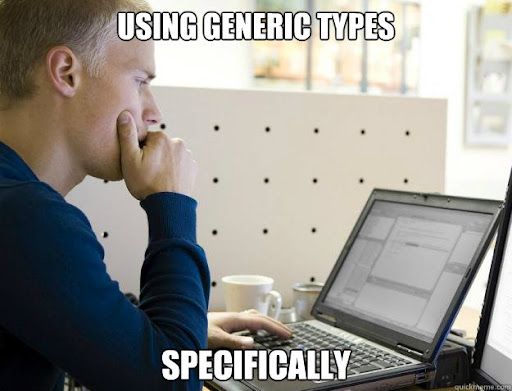
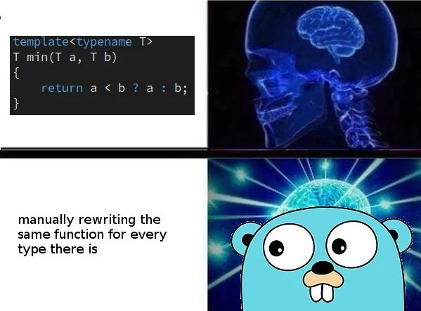

# Generic #


Generics in TypeScript allow you to create reusable components that can work with a variety of data types. They provide a way to create functions, classes, and interfaces that can operate on different types without sacrificing type safety.

```tyepescript 
function identity<T>(arg: T): T {
    return arg;
}

let output1 = identity<string>("Hello");
let output2 = identity<number>(42);
```


## usecases ##



1. Reusable Functions: Create functions that can operate on different types without losing type safety.



2. Generic Classes: Define classes that can work with various data types.
```tyepescript 
class GenericNumber<T> {
    zeroValue: T;
    add: (x: T, y: T) => T;
}

let myGenericNumber = new GenericNumber<number>();
myGenericNumber.zeroValue = 0;
myGenericNumber.add = (x, y) => x + y;
```

3. Generic Constraints: Restrict the types that can be used with generics.
```tyepescript
function loggingIdentity<T extends { length: number }>(arg: T): T {
    console.log(arg.length);
    return arg;
}

loggingIdentity("Hello");
loggingIdentity([1, 2, 3]);
```

4. Generic Components in React: Create reusable components that can handle different types of props.

```tyepescript
import React from 'react';

interface ListProps<T> {
    items: T[];
    renderItem: (item: T) => React.ReactNode;
}

function List<T>({ items, renderItem }: ListProps<T>) {
    return (
        <ul>
            {items.map((item, index) => (
                <li key={index}>{renderItem(item)}</li>
            ))}
        </ul>
    );
}

const stringList = ["Apple", "Banana", "Cherry"];
const numberList = [1, 2, 3];

<List items={stringList} renderItem={(item) => <span>{item}</span>} />;
<List items={numberList} renderItem={(item) => <span>{item}</span>} />;
```