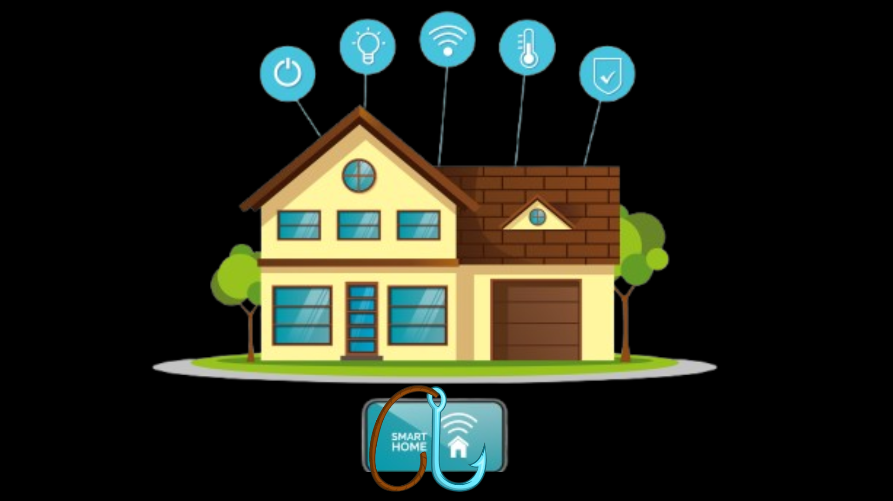
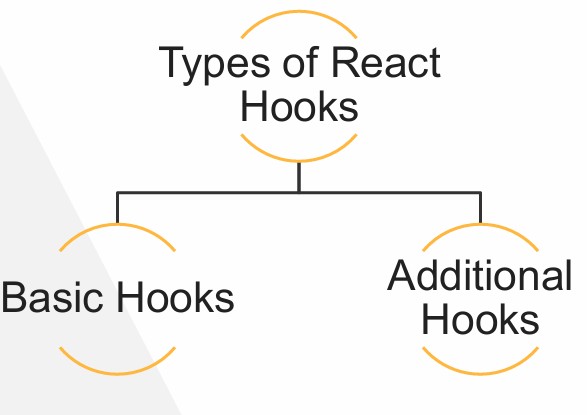
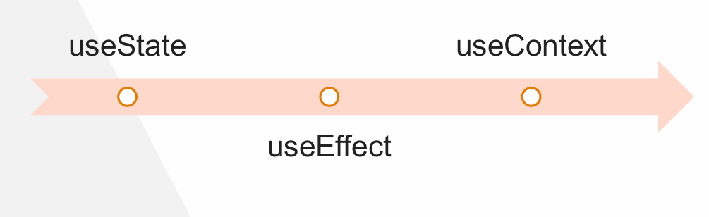
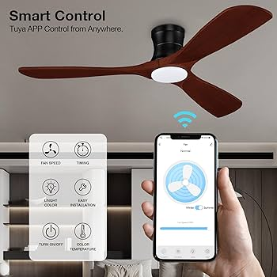
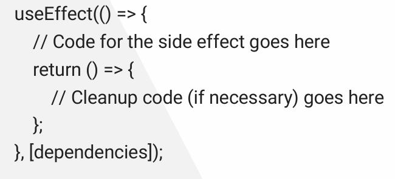
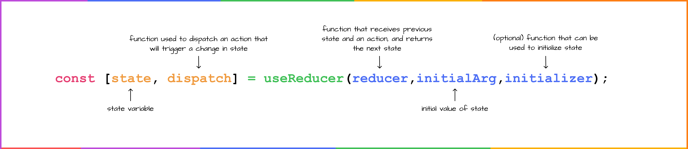
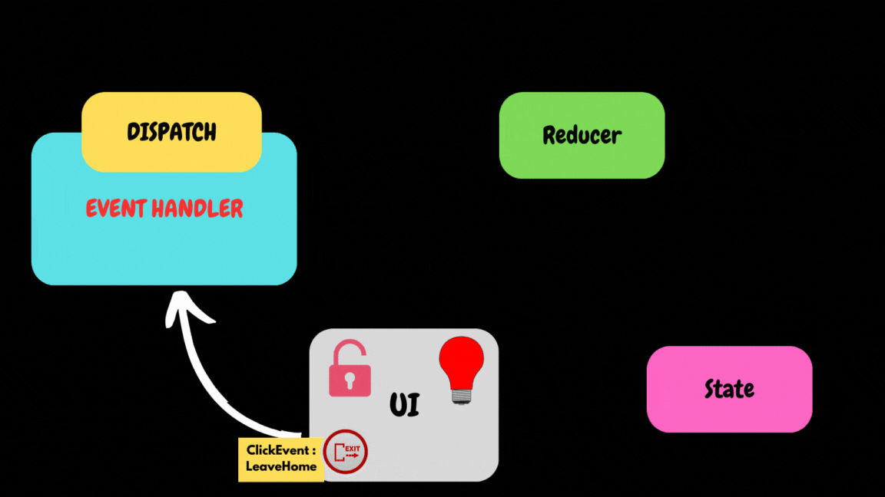

# Hooks


Imagine you are managing a smart home system. In this home (functional component), you have various devices (lights, thermostat, security cameras) that you can control and monitor (light bulp state(on/off), lightning effect) .

React Hooks are like the smart home controls that allow you to interact with these devices.


## Why Hooks ? 

Hooks are functions that let you “hook into” React state and lifecycle (reacting) features from function components. 
Hooks don’t work inside classe. 

introduced in the React 16.8  :
[](https://www.youtube.com/watch?v=dpw9EHDh2bM)


1. ***Simpler Code:*** Hooks enable you to use state and other React features in function components, making the code easier to read and maintain.
2. ***Reusability:*** Hooks allow you to reuse stateful logic without changing your component hierarchy.
3. ***Separation of Concerns:*** Hooks help separate concerns by allowing you to split one component into smaller functions based on what pieces are related.
4. ***Avoid Class Confusion:*** Hooks eliminate the need for this keyword, reducing confusion and potential errors related to class components.


## Types of hooks 




## Basic Hooks



### useState (state hook)



***Analogy:*** A smart Fan.

***Purpose:*** manage a device state (on/off) in a functional component.

```jsx
import React, { useState } from 'react';

function Fan() {
  const [isOn, setIsOn] = useState(false);

  return (
    <div>
      <h1>The fan is {isOn ? 'on' : 'off'}</h1>
      <button onClick={() => setIsOn(!isOn)}>
        {isOn ? 'Turn off' : 'Turn on'}
      </button>
    </div>
  );
}
```

### useEffect (Hook Effect)


***Analogy:*** A Smart lighting

***Explanation:*** A smart lighting system can turn lights on or off based on a schedule (night) or external conditions(front door open). Similarly, 
useEffect allows you to perform side effects (like fetching data or updating the DOM) based on certain conditions or dependencies.

***Purpose:*** manage side effects in a functional component.It does not use components lifecycle methods which are available in class component

***usecases:***
• Fetching data from an API

• Subscribing to services (like WebSockets)

• Manually updating the DOM

• Setting up timers or intervals


```jsx
  const [isDoorOpen, setIsDoorOpen] = useState(false);
  const [lightOn, setLightOn] = useState(false);

  useEffect(() => {
    if (isDoorOpen) {
        setLightOn(true);
    } else {
        setLightOn(false);
    }
}, [isDoorOpen]);
```



### useContext!


***Analogy:*** A central control panel .

***Explanation:*** A central control panel in a smart home allows you to access and control various devices from one place. useContext provides a way to access shared data(room temperature) (like themes or user settings) across different components without passing props manually.

First, create the context and provider:

```jsx
import React, { createContext, useContext, useState } from 'react';

// Create a context with default values
const SmartHomeContext = createContext();

export function SmartHomeProvider({ children }) {
    const sharedState = {temperature: 72, mode: 'cool'};

    return (
        <SmartHomeContext.Provider value={sharedState}>
            {children}
        </SmartHomeContext.Provider>
    );
}
```
Next, create the Thermostat component that consumes the context:

```jsx
function Thermostat() {
  const { temperature } = useContext(SmartHomeContext);

  return (
    <div>
      <h1>Thermostat</h1>
      <p>Current Temperature: {temperature}°C</p>
    </div>
  );
}
```

Finally, use the SmartHomeProvider to wrap your application or the part of the application where you want to access the shared state:

```jsx
function App() {
    return (
        <SmartHomeProvider>
            <Thermostat />
        </SmartHomeProvider>
    );
}
```

## Additional Hooks

React has more handy hooks beyond useState and useEffect that help you do even more cool stuff in your components.


### useReducer


***Analogy:*** A smart home automation system.

***Explanation:*** A smart home automation system can handle complex rules and actions, like turning off all lights and locking doors when you leave the house. useReducer helps manage complex state logic by using a reducer function to handle state transition

all useReducer at the top level of your component to manage its state with a reducer.
A Reducer hook can be termed as a pure function that returns a  new state whenever we take the state of an application and its
action as the argument.

The useReducer is an alternative to the useState hook for managing state in functional components. The useReducer hook is better suited for managing complex state logic while useState is best for simple state changes.



***example***
The LEAVE_HOUSE action in the reducer function is designed to simulate the scenario where you leave the house. 
When this action is dispatched, it updates the state to turn off all the lights and lock all the doors.



```jsx
import React, { useReducer } from 'react';

const initialState = {
    lightsOn: true,
    doorsLocked: false,
};

function reducer(state, action) {
    switch (action.type) {
        case 'TOGGLE_LIGHTS':
            return { ...state, lightsOn: !state.lightsOn };
        case 'TOGGLE_DOORS':
            return { ...state, doorsLocked: !state.doorsLocked };
        case 'LEAVE_HOUSE':
            return { lightsOn: false, doorsLocked: true };
        default:
            return state;
    }
}

function SmartHome() {
    const [state, dispatch] = useReducer(reducer, initialState);

    return (
        <div>
            <h1>Smart Home Control Panel</h1>
            <p>Lights are {state.lightsOn ? 'On' : 'Off'}</p>
            <p>Doors are {state.doorsLocked ? 'Locked' : 'Unlocked'}</p>
            <button onClick={() => dispatch({ type: 'TOGGLE_LIGHTS' })}>
                Toggle Lights
            </button>
            <button onClick={() => dispatch({ type: 'TOGGLE_DOORS' })}>
                Toggle Doors
            </button>
            <button onClick={() => dispatch({ type: 'LEAVE_HOUSE' })}>
                Leave House
            </button>
        </div>
    );
}

export default SmartHome;
```


### useRef -todo with forms


## Custom Hooks

Custom hooks in React are functions that allow you to extract and reuse stateful logic across multiple components. They enable you to encapsulate logic that is used by multiple components into a single function, making your code more modular and easier to maintain.  


Custom hooks in React are functions that allow you to extract and reuse stateful logic across multiple components. They enable you to encapsulate logic that is used by multiple components into a single function, making your code more modular and easier to maintain.  


### Creating a Custom Hook

A custom hook is a JavaScript function whose name starts with "use" and that may call other hooks. Here is an example of a custom hook that manages a counter:

```jsx
import { useState } from 'react';

function useCounter(initialValue = 0) {
  const [count, setCount] = useState(initialValue);

  const increment = () => setCount(count + 1);
  const decrement = () => setCount(count - 1);
  const reset = () => setCount(initialValue);

  return { count, increment, decrement, reset };
}
```

Using a Custom Hook
You can use the custom hook in any functional component just like you would use built-in hooks:

```jsx
import React from 'react';
import useCounter from './useCounter';

function CounterComponent() {
  const { count, increment, decrement, reset } = useCounter(10);

  return (
    <div>
      <p>Count: {count}</p>
      <button onClick={increment}>Increment</button>
      <button onClick={decrement}>Decrement</button>
      <button onClick={reset}>Reset</button>
    </div>
  );
}

export default CounterComponent;

```


## Rules of Hooks

### 1. Only call Hooks at the top level
Do not call Hooks inside loops, conditions, or nested functions. Hooks should always be used at the top level of the React functions. This rule ensures that Hooks are called in the same order each time a components renders. 
   
### 2. Only call Hooks from React functions
You cannot call Hooks from regular JavaScript functions. Instead, you can call Hooks from React function components. Hooks can also be called from custom Hooks.
