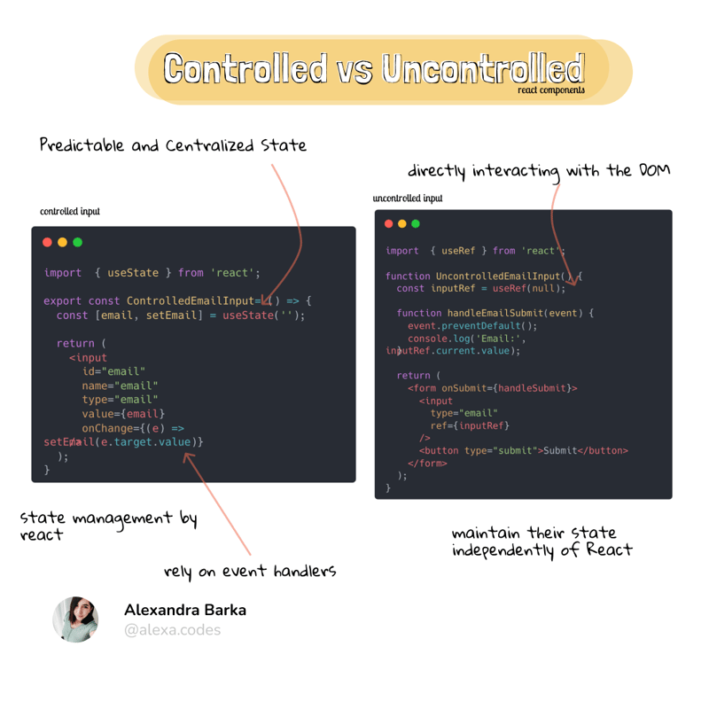

## React Forms

All of the HTML form elements that are available to the DOM are also available as React elements, which means that you may already
know how to render a form with JSX:

```jsx

function App() {
    return (
        <form>
            <input type="text" placeholder="color title..." required />
            <input type="color" required />
            <button type="submit">Submit</button>
        </form>
    );
}
```
This form element has three child elements: two input elements and a button. 
The first input element is a text input that will be used to collect the title value for new colors. The second input element is an HTML color input that will allow users to pick a color from a color wheel. We’ll be using basic HTML form validation, 
so we’ve marked both inputs as required. The ADD button will be used to add a new color.


## Controlled Components vs Uncontrolled Components

**Controlled components** are form elements whose values are controlled by React state. The value of the input is set by the state, and any changes to the input are handled by updating the state.

**Uncontrolled Components** are form elements where the form data is handled by the DOM itself, not by the React component’s state. In this approach, the form data is stored internally by the browser.



Controlled components offer a more predictable approach to state management, making them ideal for forms and components where the state needs to be synchronized with user input.

On the other hand, uncontrolled components can be simpler and more performant, especially for smaller components or when integrating with non-react code.


### Uncontrolled components - Using Ref 

When it’s time to build a form component in React, there are several patterns avail
able to you. One of these patterns involves accessing the DOM node directly using a
React feature called refs. In React, a ref is an object that stores values for the lifetime
of a component. There are several use cases that involve using refs. In this section,
we’ll look at how we can access a DOM node directly with a ref.
React provides us with a useRef hook that we can use to create a ref.

```jsx
import React, { useRef } from 'react';

function App() {
    const titleRef = useRef(null);
    const colorRef = useRef(null);

    const handleSubmit = (event) => {
        event.preventDefault(); // Prevents the default form submission
        console.log('Color Title:', titleRef.current.value);
        console.log('Color Value:', colorRef.current.value);
    };

    return (
        <form onSubmit={handleSubmit}>
            <input type="text" placeholder="color title..." required ref={titleRef} />
            <input type="color" required ref={colorRef} />
            <button type="submit">Submit</button>
        </form>
    );
}

export default App;

```


###  Controlled Components
In a controlled component, the from values are managed by React and not the DOM. They do not require us to use refs. They do not require us to write imperative code. Adding features like robust form validation is much easier when working with a controlled component. Let’s modify the AddColorForm by giving it control over the form’s

```jsx
import React, { useState } from 'react';

function App() {
    const [title, setTitle] = useState('');
    const [color, setColor] = useState('#000000');

    const handleSubmit = (event) => {
        event.preventDefault();
        console.log('Color Title:', title);
        console.log('Color Value:', color);
    };

    return (
        <form onSubmit={handleSubmit}>
            <input
                type="text"
                placeholder="color title..."
                required
                value={title}
                onChange={(e) => setTitle(e.target.value)}
            />
            <input
                type="color"
                required
                value={color}
                onChange={(e) => setColor(e.target.value)}
            />
            <button type="submit">Submit</button>
        </form>
    );
}

export default App;

```
It’s called a controlled component because React controls the state of the form. It’s worth pointing out that controlled form components are rerendered, a lot.
Think about it: every new character typed in the title field causes the AddColorForm to rerender. Using the color wheel in the color picker causes this component to rerender way more than the title field because the color value repeatedly changes as the user drags the mouse around the color wheel. 
This is OK—React is designed to handle this type of workload. Hopefully, knowing that controlled components are rerendered frequently will prevent you from adding some long and expensive process to this component.


