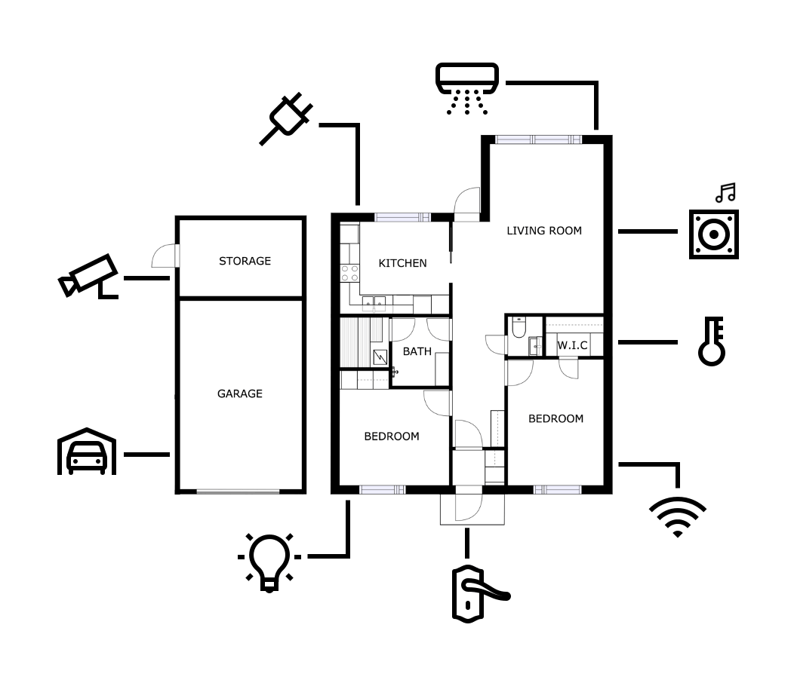
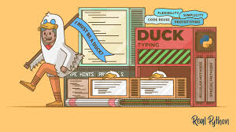
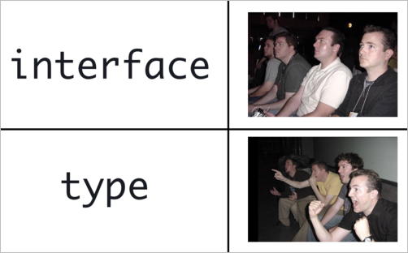

# Interface #



Interface: A blueprint that specifies the design and structure of a building.

The interface contains only the declaration of the methods and fields, but not the implementation

An Interface is a structure which acts as a contract in our application. It defines the syntax for classes to follow, means a class which implements an interface is bound to implement all its memebers. 


```typescript repl+
interface Person {
    firstName: string;
    lastName: string;
    age: number;
    getFullName(): string;
}

class Employee implements Person {
    name: string;
    age: number;
    
    constructor(name: string, age: number) {
        this.name = name;
        this.age = age;
    }

    greet(): void {
        console.log(`Hello, my name is ${this.name} and I am ${this.age} years old.`);
    }
}
```

Interface is user define type where compiler uses for type-checking (also known as "duck typing" or "structural subtyping") whether the object has a specific structure or not !

### What is duck type ? ###


>If it looks like a duck, swims like a duck, and quacks like a duck, then it probably is a duck

Duck typing in TypeScript refers to a style of dynamic typing in which an object's suitability is determined by the presence of certain methods and properties, rather than the object's actual type. This is also known as "structural typing" or "structural subtyping".

eg

```typescript repl+
interface Point {
    x: number;
    y: number;
}

function logPoint(point: Point) {
    console.log(`${point.x}, ${point.y}`);
}

let point1Obj = { x: 10, y: 20 };
let point2Obj = { x: 10, y: 20, z: 30 };

logPoint(point1Obj); // Valid : comiler compare the value and assume the type 
logPoint(point2Obj); // Valid, extra properties are ignored
```


## Interface vs (Object) type  ##

type aliases can act sort of like interfaces, however, there are some subtle differences

### Interface ###
Purpose: Defines a contract that classes must follow.
Usage: Used to describe the shape of an object, specifying what properties and methods it should have.
Example: Think of it as a job description that lists the tasks and skills required for a job.

### (Object) type ( Type Aliases)###
Purpose: Defines a type alias, which can be used to create more complex types.
Usage: Used to create new names for types, including unions, intersections, and more.
Example: Think of it as a nickname or shorthand for a combination of different things.

```typescript repl+
type ID = string | number;
type Point = { x: number; y: number };
type Person = { name: string; age: number } & Point;
```

>Interfaces are primarily used to define the structure of objects and are more suited for defining contracts for classes.
Types are more flexible and can be used to create complex types, including unions and intersections.



Ref:
https://www.typescriptlang.org/docs/handbook/2/objects.html
https://medium.com/@martin_hotell/interface-vs-type-alias-in-typescript-2-7-2a8f1777af4c
https://stackoverflow.com/questions/37233735/interfaces-vs-types-in-typescript

>