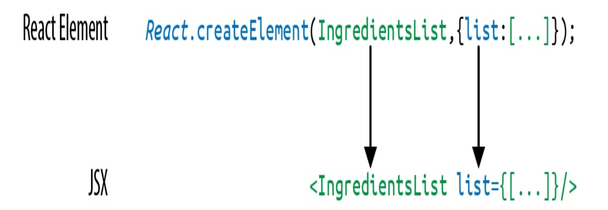

# Jsx #

JSX combines the JS from JavaScript and the X from XML. 

Sometimes JSX is confused with HTML because they look similar. 
JSX is just another way of creating React elements, so it is a syntactic sugar for React.createElement calls, making the code more readable and easier to write.





## What JSX provide ##

### Nested Component ###

JSX allows you to add components as children of other components.
For example, inside the IngredientsList, we can render another
component called Ingredient multiple times

```jsx
<IngredientsList>
    <Ingredient />
    <Ingredient />
    <Ingredient />
</IngredientsList>

```

### class Name ###

Since class is a reserved word in JavaScript, className is used to
define the class attribute instead:

```jsx
<h1 className="fancy">Baked Salmon</h1>
```

### JAVASCRIPT EXPRESSIONS ###

JavaScript expressions are wrapped in curly braces and indicate where
variables will be evaluated and their resulting values returned.

```jsx
const name = 'John';
const element = <h1>Hello, {name}!</h1>;
```

### Mapping Arrays with JSX ###

JSX is JavaScript, so you can incorporate JSX directly inside of
JavaScript functions.

```jsx
<ul>
{props.ingredients.map((ingredient, i) => (
<li key="{i}">{ingredient}</li>
))}
</ul>
```


## React Fragment ##

Fragments let you group a list of children without adding extra nodes to the DOM.

<Fragment>, often used via <>...</> syntax

```jsx
function Post() {
  return (
    <>
      <PostTitle />
      <PostBody />
    </>
  );
```