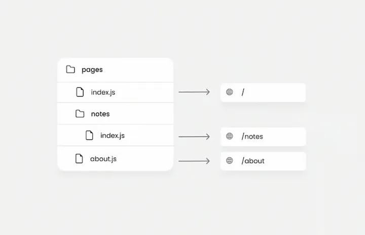
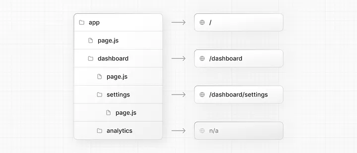
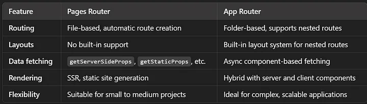
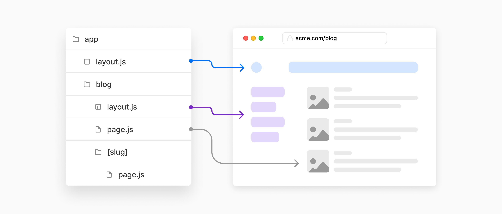

# Routing 

# Page Routing vs App Routing 


Think of the pages directory-based routing as a traditional physical book: : Like a traditional physical book with a straightforward table of contents and chapters, 
and you navigate by turning pages. In contrast, the app directory-based routing is like an interactive digital book: you can jump to different sections, navigate nested layouts, and use server components for dynamic content.


## Page Routing 

The Pages Router has a file-system based router built on concepts of pages. When a file is added to the pages directory it's automatically available as a route.


###  File-Based Routing:
Routes are automatically created based on the file structure within the pages directory.

pages/index.js -> /
pages/about.js -> /about
pages/blog/[id].js -> /blog/:id




### Dynamic Routes:
Use square brackets to define dynamic routes.
Example: pages/blog/[id].js for /blog/:id.

### API Routes:

You can create API endpoints within the pages/api directory.
Example: pages/api/hello.js -> /api/hello


### Static and Server-Side Rendering:

Use getStaticProps, getServerSideProps, and getStaticPaths for data fetching and rendering.

[more](https://github.com/parane/web-development/tree/react/nextjs/route/ssr-ssg)

Example 

```jsx
// pages/index.js
import React from 'react';

const Home = () => {
    return <h1>Home Page</h1>;
};

export default Home;
```

```jsx
// pages/about.js
import React from 'react';

const About = () => {
    return <h1>About Page</h1>;
};

export default About;

```

```jsx
// pages/blog/[id].js
import React from 'react';
import { useRouter } from 'next/router';

const BlogPost = () => {
    const router = useRouter();
    const { id } = router.query;

    return <h1>Blog Post {id}</h1>;
};

export default BlogPost;
```

[more detail](https://nextjs.org/docs/pages/building-your-application/routing)

##  App Directory-Based Routing (New in Next.js 13)

The Next.js App Router introduces a new model for building applications using React's latest features such as Server Components, Streaming with Suspense, and Server Actions.


###  Nested Layouts:  
Supports nested layouts and nested routing.



Example:
app/layout.js for a global layout.
app/dashboard/layout.js for a nested layout under /dashboard.


### Server Components:

Allows the use of React Server Components for improved performance and scalability.


### File-Based Routing:

Similar to the pages directory, but with support for nested routes and layouts.
Example:
app/page.js -> /
app/about/page.js -> /about
app/blog/[id]/page.js -> /blog/:id


### API Routes:
API routes can be created within the app/api directory.
Example: app/api/hello/route.js -> /api/hello


eg

```jsx
// app/page.js
import React from 'react';

const Home = () => {
    return <h1>Home Page</h1>;
};

export default Home;
```

```jsx
// app/about/page.js
import React from 'react';

const About = () => {
    return <h1>About Page</h1>;
};

export default About;

```


```jsx
// app/blog/[id]/page.js
import React from 'react';

const BlogPost = ({ params }) => {
    const { id } = params;

    return <h1>Blog Post {id}</h1>;
};

export default BlogPost;
```


>>With the App Router, Next.js introduces a new way to handle data fetching using React Server Components and React Suspense. Instead of using getStaticProps and getServerSideProps, you can now fetch data directly inside your components or server components using async functions

[more](https://github.com/parane/web-development/tree/react/nextjs/route/server-client-component)

##comparision




Layout is a component that wraps around other components to provide a consistent structure or design across multiple pages. Layouts typically include elements like headers, footers, and navigation menus that are common across different pages of an application.
In the app directory-based routing, layouts are a first-class concept and can be nested. You define them using layout.js files.


## Navigating between pages 

In Next.js, you can navigate between pages using the Link component from the next/link package. This component allows for client-side transitions, which improves performance and user experience.


```md
my-next-app/
├── app/
│   ├── layout.tsx         // Global layout
│   ├── page.tsx           // Home page (route: /)
│   ├── blog/
│   │   └── page.tsx       // About page (route: /about)
```

Global Layout (app/layout.tsx)

```jsx
import React from 'react';
import Link from 'next/link';

const Layout = ({ children }) => {
    return (
        <div>
            <header>
                <nav>
                    <Link href="/"><a>Home</a></Link>
                    <Link href="/blog"><a>About</a></Link>
                </nav>
            </header>
            <main>{children}</main>
            <footer>Footer</footer>
        </div>
    );
};

export default Layout;
```


### Home page (app)

```jsx
import React from 'react';
import Layout from './layout';

const Home = () => {
    return (
        <Layout>
            <h1>Home Page</h1>
        </Layout>
    );
};

export default Home;
```

### Blog Page (app/blog/page.tsx)

```jsx
import React from 'react';
import Layout from '../layout';

const Blog = () => {
    return (
        <Layout>
            <h1>Blog Page</h1>
        </Layout>
    );
};

export default Blog;
```

Link Component: The Link component from next/link is used to create links for client-side navigation.
href Prop: The href prop specifies the path to navigate to.