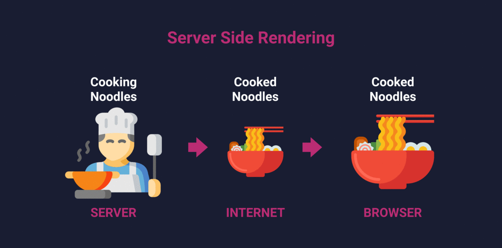
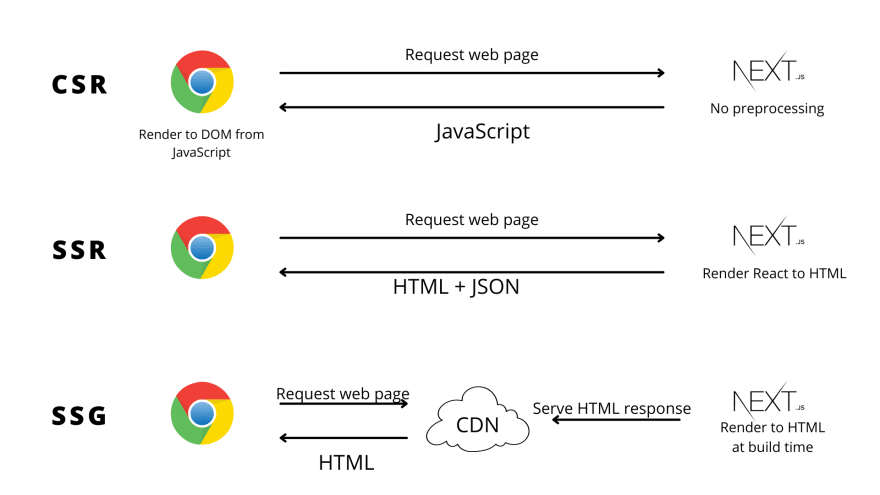

SSR (Server-Side Rendering) vs SSG (Static Site Generation) vs CSG (Client-Side Generation)


SSR (Server-Side Rendering):

Imagine you walk into a noodle restaurant and place your order. The chef prepares your noodles fresh in the kitchen and serves them to you hot and ready to eat.
In web terms, the server prepares the HTML for each page request and sends it to the browser. This means the content is ready to be displayed as soon as it arrives.

SSG (Static Site Generation):

Think of a noodle shop that prepares a variety of noodle dishes in advance and stores them in a display case. When you order, they quickly hand you a pre-made dish.
Similarly, with SSG, the HTML for all pages is generated at build time and stored as static files. When a user requests a page, the server quickly serves the pre-built HTML.

CSG (Client-Side Generation):

Imagine a noodle shop where you order your noodles, but instead of the chef preparing them, you receive a noodle-making kit with all the ingredients and instructions to make the noodles yourself at home.
In web development, CSG means the browser receives a basic HTML shell and JavaScript files. The JavaScript then fetches data and generates the content dynamically on the client side.




## SSG - Static Site Generation 

Static Site Generation (SSG) is a method of pre-rendering web pages at build time. This means that the HTML for all pages is generated once, during the build process, and then served as static files. This approach offers several benefits: 

### Benefits of SSG:
Performance: Since the HTML is pre-generated and served as static files, the pages load very quickly.
Scalability: Static files can be easily served by a Content Delivery Network (CDN), making it easy to scale.
SEO: Pre-rendered HTML is ready for search engine crawlers, improving SEO.
Security: Static sites have fewer attack vectors compared to dynamic sites.

### How SSG Works:
Build Time: During the build process, the site generator (e.g., Next.js) creates static HTML files for each page.
Deployment: These static files are then deployed to a web server or CDN.
Request Handling: When a user requests a page, the server quickly serves the pre-built HTML file.

In Next.js, you can use the getStaticProps function to fetch data at build time and generate static pages.

```jsx
// pages/index.js
import React from 'react';

export async function getStaticProps() {
    // Fetch data at build time
    const res = await fetch('https://api.example.com/data');
    const data = await res.json();

    return {
        props: {
            data,
        },
    };
}

const Home = ({ data }) => {
    return (
        <div>
            <h1>Static Site Generation with Next.js</h1>
            <pre>{JSON.stringify(data, null, 2)}</pre>
        </div>
    );
};

export default Home;
```

### Explanation:
**getStaticProps**: This function runs at build time and fetches data from an API.
Props: The fetched data is passed as props to the Home component.
Static HTML: Next.js generates static HTML for the Home page using the fetched data.

### usecases: 

Blog Posts: For content that doesn't change often, such as blog posts, documentation, or marketing pages.
E-commerce Product Pages: For product pages that don't change frequently and can be pre-rendered.
Landing Pages: For static landing pages that need to load quickly and be SEO-friendly.


## SSR - Server-Side Rendering

Server-Side Rendering (SSR) is a technique used in web development where the server generates the HTML for a web page on each request. This means that when a user requests a page, the server processes the request, fetches the necessary data, and returns a fully rendered HTML page to the client. This approach has several benefits:

### Benefits of SSR:
Improved Performance: The initial load time is faster because the HTML is already rendered on the server.
SEO: Search engines can crawl and index the fully rendered HTML, improving SEO.
Better User Experience: Users see the content faster as the server sends a complete HTML page.

### How SSR Works:
Request: A user requests a page by entering a URL or clicking a link.
Server Processing: The server processes the request, fetches data from a database or API, and renders the HTML.
Response: The server sends the fully rendered HTML page to the client.
Client Rendering: The browser displays the HTML page to the user.

In Next.js, you can use the getServerSideProps function to fetch data and render the page on the server for each request.

```jsx
// pages/index.js
import React from 'react';

export async function getServerSideProps() {
    // Fetch data from an API or database
    const res = await fetch('https://api.example.com/data');
    const data = await res.json();

    return {
        props: {
            data,
        },
    };
}

const Home = ({ data }) => {
    return (
        <div>
            <h1>Server-Side Rendering with Next.js</h1>
            <pre>{JSON.stringify(data, null, 2)}</pre>
        </div>
    );
};

export default Home;
```

### Explanation:
**getServerSideProps:** This function runs on the server for each request. It fetches data from an API or database.
Props: The fetched data is passed as props to the Home component.
Server-Side Rendering: Next.js generates the HTML on the server and sends it to the client.

### usecases

Dynamic Content: When you need to fetch data that changes frequently and must be up-to-date on each request.
Personalized Content: When the content needs to be personalized based on user data or session information.
SEO: When you need to ensure that search engines can crawl and index the latest content.


## CSG - Client-Side Generation

Client-Side Generation (CSG) is a technique where the browser generates the content dynamically on the client side. This means that the server sends a basic HTML shell and JavaScript files to the client, and the JavaScript fetches data and generates the content dynamically.

### Benefits of CSG:

Interactivity: Allows for highly interactive and dynamic user interfaces.
Reduced Server Load: Offloads rendering work to the client, reducing the server's workload.
Real-Time Data: Ideal for applications that require real-time data updates, such as chat applications or live sports scores.


### How CSG Works:

Initial Request: The client requests a page.
HTML Shell: The server responds with a basic HTML shell and JavaScript files.
Data Fetching: The JavaScript on the client fetches data from APIs or other sources.
Content Generation: The JavaScript dynamically generates and updates the content in the browser.

In a React application, you can use hooks like useEffect to fetch data and update the state, which then updates the UI.


```jsx
import React, { useEffect, useState } from 'react';

const Home = () => {
    const [data, setData] = useState(null);

    useEffect(() => {
        // Fetch data from an API
        fetch('https://api.example.com/data')
            .then((response) => response.json())
            .then((data) => setData(data));
    }, []);

    if (!data) {
        return <div>Loading...</div>;
    }

    return (
        <div>
            <h1>Client-Side Generation with React</h1>
            <pre>{JSON.stringify(data, null, 2)}</pre>
        </div>
    );
};

export default Home;

```