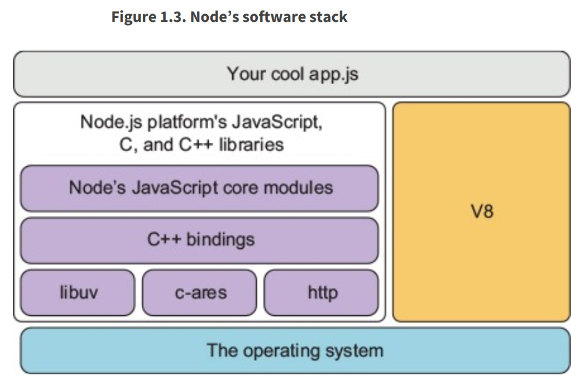
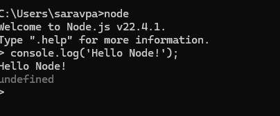
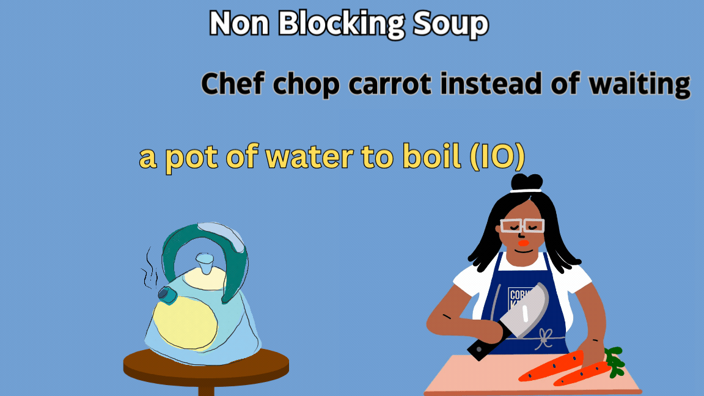
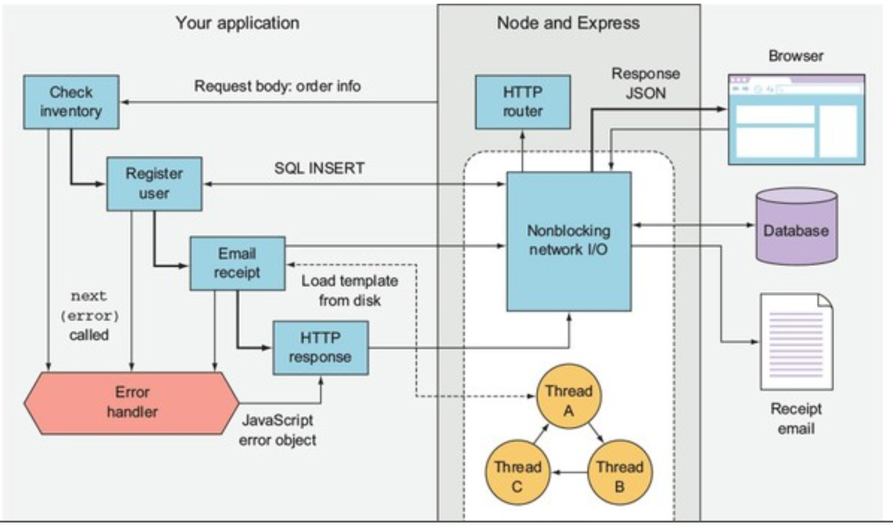
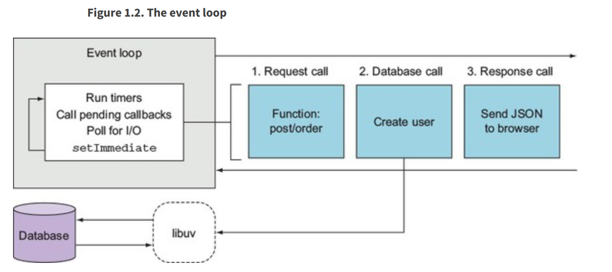

# Node js #
Node came about when the original developers took JavaScript, something you could usually only run inside the browser, and they let it run on your machine as a standalone process. 
This means that we could create applications using JavaScript outside the context of the browser

With Node, we now have a feature set that looks much more similar to other backend languages, such as Java, Python, or PHP.
Some of these are as follows:
-We can write Node applications using the JavaScript syntax
-You can manipulate your filesystem, creating and removing folders
-You can create query databases directly
-You can even create web servers using Node

### Installation ###
Download and install Node.js from https://nodejs.org/. 
This will also install npm (Node Package Manager) automatically.

### Running ###

what actually happened behind the scenes? Well, this is what Node does. It takes
your JavaScript code, it compiles it into machine code, and executes it. In the preceding
code, you can see it executed our code, printing out Hello world

>**what is Node?** You can say Node's a JavaScript runtime that
uses the V8 engine. When they ask you what the V8 engine is, you can say the V8 engine is an
open source JavaScript engine written in C++ that takes JavaScript code and compiles it to machine
code. It's used inside Node.js and it's used in the Chrome browser.

### Features ###

#### 1. Non-Blocking I/O: ####
Node.js uses an event-driven, non-blocking I/O model, which makes it highly efficient and suitable for real-time applications. 
This model allows Node.js to handle many connections simultaneously without being bogged down by slow I/O operations. 

**Non blocking :**

>Imagine a chef in a busy restaurant kitchen. Instead of waiting for a pot of water to boil before starting to chop vegetables, the chef can start chopping vegetables while the water is heating up. This way, the chef can handle multiple tasks simultaneously without being blocked by one task. Similarly, in non-blocking I/O, the system can start other operations while waiting for I/O operations (like reading a file or fetching data from a database) to complete.

Single Thread: Node.js runs on a single thread, which means it uses a single process to handle multiple requests.

##### Take following scenario: #####
- A user makes a request to buy a product

Single Thread: Node.js runs on a single thread, which means it uses a single process to handle multiple requests.
Browsers make requests to buy a product, and then the application checks the current stock inventory, creates an account for the user, emails the receipt, and sends back a JSON HTTP response. Concurrently, other things happen as well: an email receipt is sent, and a database is updated with the user’s details and order. The code itself is straightforward, imperative JavaScript, but the runtime behaves concurrently because it uses nonblocking I/O

The real benefit to using asynchronous APIs with nonblocking I/O is that Node can do other things while these comparatively slow processes happen. Even though you have only a single threaded, single process Node web app running, it can handle more than one connection from potentially thousands of website visitors at any one time.

**Event Driven**

>Imagine a waiter scenario, his is similar to an event-driven model where the system responds to events (like user actions or I/O completion) and executes the corresponding callback functions. This model allows the system to handle multiple events simultaneously and respond to them in an asynchronous manner.

**Event Loop**

This whole process uses a minimum of three nonblocking network calls: one for the request, one for the database, and another
for the response. How does Node schedule all these nonblocking network operations?
The answer is the event loop.

When a request involves I/O operations (like reading a file or querying a database), Node.js does not wait for the operation to complete. Instead, it continues to process other requests in event loop. Once the I/O operation is complete, a callback function is executed to handle the result.

#### 2. Node app Everywhere: ####
Node.js allows developers to use JavaScript for both client-side and server-side development. This unification simplifies the development process and allows for code reuse across the entire application stack. 
Node programs can be divided into three typical types: web applications, commandline tools and daemons, and desktop applications. Web applications include simple apps that serve up single page applications, REST microservices, and full stack web apps.

**2.1 Web application**
Node is server-side JavaScript, so it makes sense as a platform for building web applications. By running JavaScript on both the client and server, opportunities exist for code reuse between each environment.

Node is also a big part of the front-end development world, because it’s the main tool used when transpiling other languages such as TypeScript to JavaScript. 
Transpilers compile languages from one high-level language to another (ts to js) ; 
this contrasts with traditional compilers, which compile from high-level to low-level languages (java to class)

**2.2 Command line tool**

you may have already used command-line tools written with Node—for example, npm install. it executes a series of scripts to install the dependencies listed in your package.json file.(link)[https://github.com/npm/cli] 
 
> Dependency management :  npm is the default package manager for Node.js. It helps manage and share JavaScript code by providing a repository for Node.js packages/modules.

Node is used to write command-line tools such as process managers and JavaScript transpilers that are used by JavaScript developers. But it’s also used as a convenient way to write handy command-line tools that do other things, including image conversion, and scripts for controlling media playback.

**2.3 Desktop applications**

If you’ve been using the Atom or Visual Studio Code text editors, then you’ve been using Node all along.
Node is used to write desktop applications, and it’s a great way to write cross-platform applications that run on Windows, macOS, and Linux.

