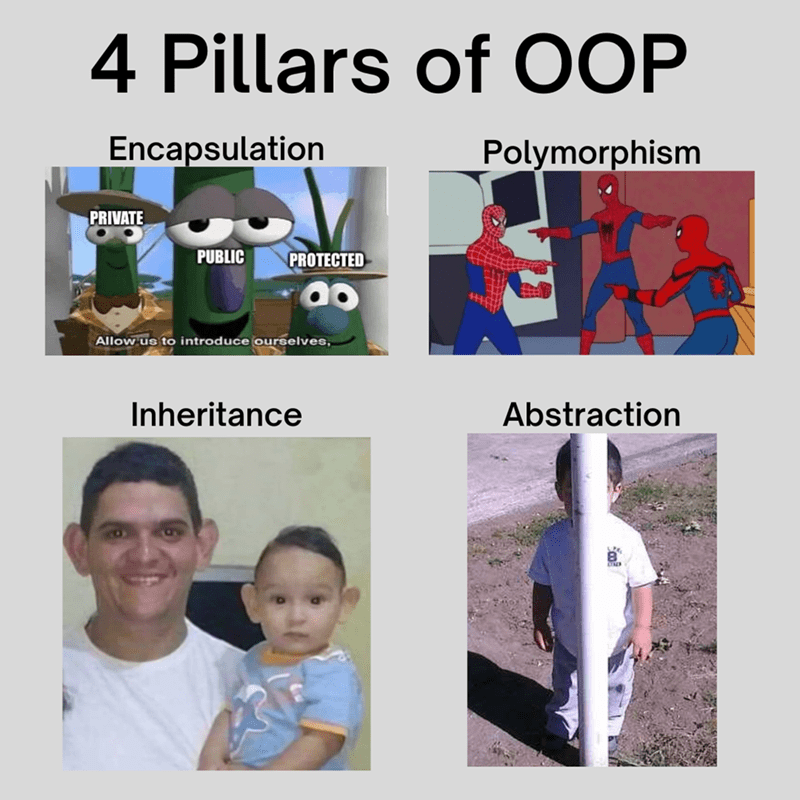

# OOP #

Object-Oriented Programming (OOP) is a programming paradigm based on the concept of "objects", which can contain data and code to manipulate that data. JavaScript supports OOP through its prototype-based inheritance model.
Key Concepts
Classes: Templates for creating objects.
Objects: Instances of classes.
Inheritance: Mechanism to create a new class using an existing class.
Encapsulation: Bundling data and methods that operate on the data within one unit.
Polymorphism: Ability to process objects differently based on their data type or class.

Lets see the Javascript OOP Cababilities :

1. [Object](https://github.com/parane/web-development/tree/javascript/oop/Object.md)
2. [Class](https://github.com/parane/web-development/tree/javascript/oop/class.md)
3. [prototype](https://github.com/parane/web-development/tree/javascript/oop/prototype.md)

