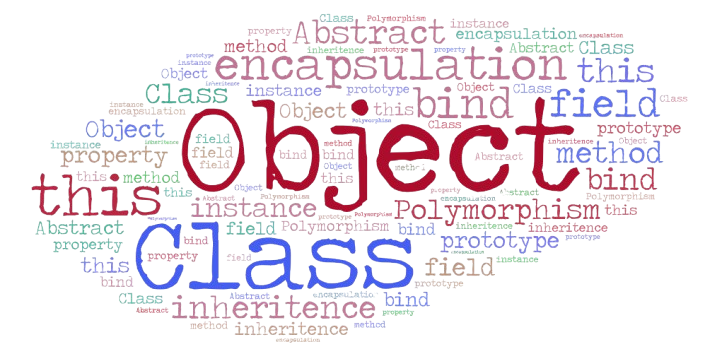

# OOP #

Object-Oriented Programming (OOP) is a programming paradigm based on the concept of "objects", which can contain data and code to manipulate that data. JavaScript supports OOP through its prototype-based inheritance model.

## Key Concepts ##
Classes: Templates for creating objects.

Objects: Instances of classes.
>Prototype A prototype is also an object. All JavaScript objects inherit their properties and methods from their prototype.

## Four Pillars of OOP ##

Inheritance: Mechanism to create a new class using an existing class.

Encapsulation: Bundling data and methods that operate on the data within one unit.

Polymorphism: Ability to process objects differently based on their data type or class.

Lets see the Javascript OOP Cababilities :

1. [Object](https://github.com/parane/web-development/tree/javascript/oop/script/Object.md)
2. [Class](https://github.com/parane/web-development/tree/javascript/oop/script/class.md)
3. [OOP](https://github.com/parane/web-development/tree/javascript/oop/script/OOP.md)
4. [Design Pattern](https://github.com/parane/web-development/tree/javascript/oop/script/design_pattern.md)

Reference: 
1. Rediscovering JavaScript
2. O'Reilly - You Don't Know JS. this & Object Prototypes [here](https://github.com/gauravmehla/Javascript-bookshelf)

[Back](https://github.com/parane/web-development/tree/javascript?tab=readme-ov-file#table-of-content)
