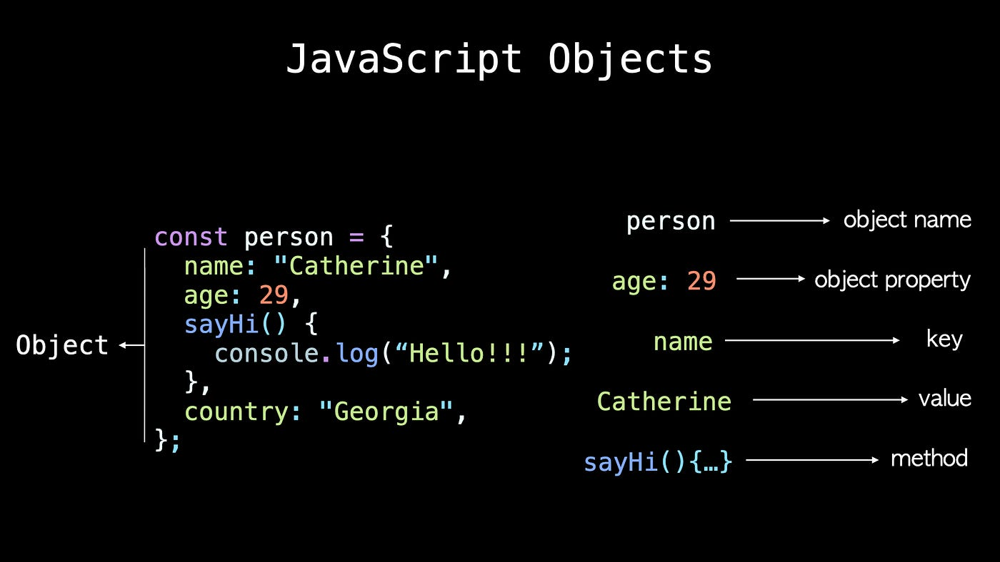
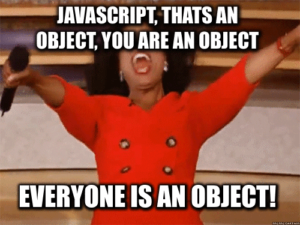

## Objects in Js ##
An object in JavaScript is a collection of properties, where each property is defined as a key-value pair. Objects can contain both data (in the form of properties) and functions (in the form of methods). They are used to store and manipulate data in a structured way.

eg:



### Object Type ###
Object is a type in JavaScript just like string, number etc. There are subtypes to objects, which are

String

Number

Array

Function

RegEx

Object

Boolean

Date

Error




### Object creation  ###
We can create objects using
- object literals like ```let object = { a: 10} ```
- using Object constructor like ```javascript let object = new Object(); object.a = 10```

### Object's Property accessing  ###
It is not like that the the values are stored “inside” the object against the keys, rather the keys are pointers (references) to where the actual values are stored in memory.
There are two ways to access the values stored against a key, one is using . operator and other is using the [] operator, for instance

```javascript repl+
let object = { a: 10}

object.a 
object["a"]
```

In objects, property names are always strings. If you use any other value besides a string (primitive) as the property,
it will first be converted to a string.

```javascript repl+
var myObject = { };

myObject[true] = "foo";
myObject[3] = "bar";
myObject[myObject] = "baz";

myObject["true"]; // "foo"
myObject["3"]; // "bar"
myObject["[object Object]"]; // "baz"
```

ES6 adds computed property names, where you can specify an expression, surrounded by a [ ] pair, in the key-name position of an object-literal declaration:

```javascript repl+
var prefix = "foo";

var myObject = {
    [prefix + "bar"]: "hello",
    [prefix + "baz"]: "world"
};

myObject["foobar"]; // hello
myObject["foobaz"]; // world

```

## Property Versus Method ##

Every time you access a property on an object, that is a property access, regardless of the type of value you get back. If you happen to get a function from that property access, it’s not magically a “method” at that point. There’s nothing special (outside of possible implicit this binding as explained earlier) about a function that comes from a property access.

```javascript repl+
function foo() {
    console.log( "foo" );
}

var someFoo = foo; // variable reference to `foo`

var myObject = {
    someFoo: foo
};

foo; // function foo(){..}

someFoo; // function foo(){..}

myObject.someFoo; // function foo(){..}

```

someFoo and myObject.someFoo are just two separate references to the same function, and neither implies anything about the function being special or “owned” by any other object. If foo() was defined to have a this reference inside it, that myObject.someFoo implicit binding would be the only observable difference between the two references. It doesn’t make sense to call either reference a “method.”

Perhaps one could argue that a function becomes a method, not at definition time, but during runtime just for that invocation, depending on how it’s called at its call-site.

### this  ###
Some part are discussed in function section. Here we are going to discuss on Object Oreiented perspective

In js , the function as an object (all functions in JavaScript are objects!) lets you store state (values in properties) between function calls.

Lets see this ?

``` javascript repl+

var name = "Global"
function foo() {
    console.log(this.name);
}

var myObject = {
    name:'myObject',
    someFoo: foo
};

foo(); //function context /global context
myObject.someFoo(); //myObject method context 

```

But wait, This is not straight forward !

this points to a context object that is determined by how the function is called and not by lexical scope rules.
this is a binding to an object, that is made for each function invocation and is based on the call-site (how and where the function is called).

this mechanism gives a sense of dynamic scope in JavaScript.

``` javascript repl+

function foo(num) {
  //do something

  // update the count on function object
  this.count++;
}

// initialize count property in foo object
foo.count = 0;


  foo( 1);
  foo( 2 );

console.log( foo.count ); // 0 -- WTF?
// this logs 0, seems like count was never updated

```

count is in foo function , but why is it not updated ?
- doesnot point to function Object at all ?  tries to update count on the global object.
  So here this is dynamic scope ! takes value from call site.

So come across this issue

you may  access via function identifier

``` javascript repl+

function foo(num) {
  //do something

  // update the count on function object
  foo.count++;
}

// initialize count property in foo object
foo.count = 0;


  foo( 1);
  foo( 2 );

console.log( foo.count ); // 2- correntct

```
How can we make sure this ?

### Using Binding ###
>I ll not cover depth as in react i ll not use much class component. So this section intense to give some basic undestanding
on OOP. If you want a deep dive , Pls Refer this book You Don't Know JS: this & Object Prototypes

This is particularly useful when you want to ensure that a function uses a specific context, regardless of how it is called.
The bind method creates a new function that, when called, has its this keyword set to the provided value.

``` javascript repl+

function foo(num) {
  //do something

  // update the count on function object
  this.count++;
}

// initialize count property in foo object
foo.count = 0;

var boundFoo = foo.bind(foo); // Bind `foo` to itself

  boundFoo( 1);  //call boundfoo , not foo!
  boundFoo( 2 );
console.log(foo.count); // 2

```

bind: Creates a new function with this bound to a specific object.
call and apply: Invoke a function with this set to a specific object.
Arrow Functions: Inherit this from the surrounding lexical context.
