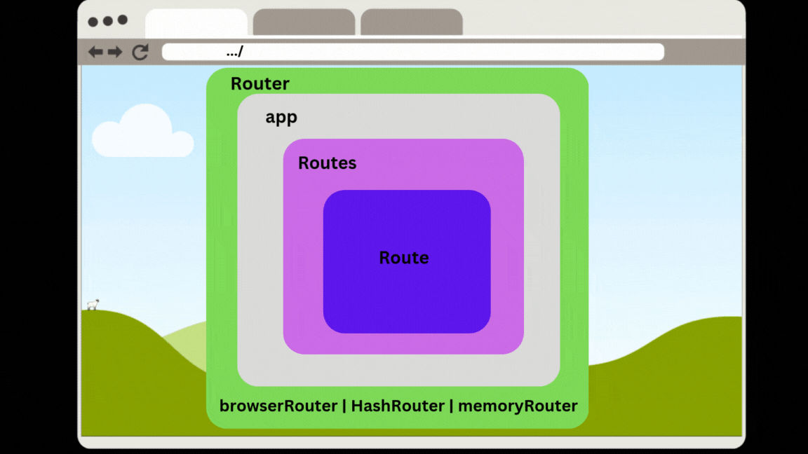
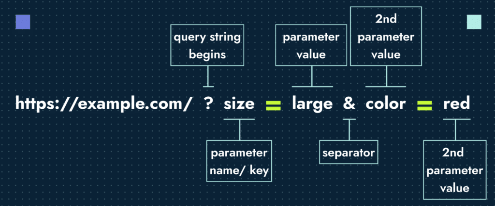

#  Router


The location of the current file or resource was listed in the browser’s location bar. The browser’s forward and back buttons would work as expected. Bookmarking content deep within a website would allow
users to save a reference to a specific file that could be reloaded at the user’s request. On a page-based, or server-rendered, website, the  browser’s navigation and history features simply work as expected.
In a single-page app, all of these features become problematic.

Remember, in a single-page app, everything is happening on the same page. 
JavaScript is loading information and changing the UI. Features like browser history, bookmarks, and forward and back buttons will not work without a routing solution. Routing is the process of defining endpoints for your client’s requests. These endpoints work in conjunction with the browser’s location and history objects. 
They’re used to identify requested content so that JavaScript can load and render the appropriate user interface.


##   React Router v6
React Router is a standard library for routing in React. Routing in React refers to the process of navigating between different components or pages within a React application based on the current URL.

It allows you to create multi page applications where each page is represented by a separate component.



## Basic Setup


```bash
npm install react-router-dom@6
```

### Router 

```jsx
import { BrowserRouter as Router} from 'react-router-dom';
.
.
<Router>
</Router>
```

### BrowserRouter and HashRouter and memoryRouter

BrowserRouter and HashRouter are two different types of routers provided by react-router-dom for handling routing in React applications. 

#### BrowserRouter

BrowserRouter uses the HTML5 history API (pushState, replaceState, and the popstate event) to keep your UI in sync with the URL. 

***When to use BrowserRouter:***

- It is the recommended router for most applications.
- When your server supports all URLs pointing to index.html, allowing React to manage the routing


#### HashRouter
HashRouter uses the hash portion of the URL (i.e., window.location.hash) to keep your UI in sync with the URL.

***When to use BrowserRouter:***

- It is useful for legacy browsers or when you cannot configure your server to handle dynamic routes.
- When you need to serve static files and don’t have control over server configuration.

#### MemoryRouter

MemoryRouter doesn't use the URL for routing. Instead, it keeps the routing history internally in memory.

***When to use BrowserRouter:***
- For testing and non-browser environments like React Native.
- Hide the url in browser bar, When you want to control navigation programmatically.

### Routes and route 


The next step is to use React router to implement routing. The first step is configuring all of our routes (all the pages/components we want to navigate).

Routes: A container for all your route definitions.
Route: Defines a single route with a path and the component to render.

```jsx

import { BrowserRouter as Router, Route, Routes } from 'react-router-dom';

function App() {
    return (
        <Router>
            <Routes>
                <Route path="/" element={<Home />} />
                <Route path="/about" element={<About />} />
                <Route path="/contact" element={<Contact />} />
            </Routes>
        </Router>
    );
}

```
Now that you know how to map the app's location to certain React components using Routes and Route, the next step is being able to navigate between them.

This is the purpose of the **Link** component.

### Link and NavLink

Link is used to create navigational links in a React application. It allows you to navigate to different routes defined in your application without reloading the page.

NavLink: Similar to Link but provides additional styling attributes when the link is active.

```jsx
import { Link } from 'react-router-dom';

function Navigation() {
    return (
        <nav>
            <NavLink to="/" activeClassName="active">Home</NavLink>
            <Link to="/about">About</Link>
            <Link to="/contact">Contact</Link>
        </nav>
    );
}
```

#### summary:
Routes: Define the mapping between URL paths and components. They handle the logic of which component to render based on the URL.
Links: Provide the user interface elements that users click on to navigate to different routes.


## Passing down information through routes

In React Router 6, you can pass information or data to components via routes in several ways, such as through 

1. URL parameters, 
2. query strings, 
3. route state.

This allows your components to be dynamic and responsive to the specific data being passed through the route.

### 1. URL parameters

URL parameters are a common way to pass information directly through the route. 
These parameters are part of the URL and can be accessed within the routed component using React Router's useParams hook.

```jsx
<Route path="/user/:userId" element={<UserProfile />} />
```

```jsx
import { useParams } from 'react-router-dom';

function UserProfile() {
    const { userId } = useParams();
    return <div>User Profile: {userId}</div>;
}
```

### 2. Query Strings
They're the ? and & you see appended onto URLs. They're a fundamental aspect of how the Web works as they allow you to pass state via the URL.



As of v6, React Router relies heavily on the __URLSearchParams__ API to deal with query strings. __URLSearchParams__ is built into all browsers (except for IE) and gives you utility methods for dealing with query strings.

To do this, React Router comes with a custom __useSearchParams__ Hook which is a small wrapper over __URLSearchParams__.

useSearchParams returns an array with the first element being an instance of URLSearchParams and the second element being a way to update the query string.

```jsx
import { useSearchParams } from 'react-router-dom'

const Results = () => {
    const [searchParams, setSearchParams] = useSearchParams();

    const q = searchParams.get('size')
    const src = searchParams.get('color')

    return (
        ...
   )
}
```
- [Query Param](https://ui.dev/react-router-query-strings)


### 3. using Route State
React Router 6 allows you to pass state directly through navigation.
To pass data through a Link component to a new route, use Link's state prop.
This is particularly useful for passing complex objects or data that you don’t want to expose in the URL.

```jsx
const user = { name: 'John', age: 30 };

<nav>
  <Link to="/">Home</Link>
  <Link to="/about">About</Link>
  <Link to="/dashboard" state={{user}} >
      dashboard
  </Link>
</nav>

function Dashboard() {
    const { user } = useLocation().state;
    return <div>Dashboard: {user.name}</div>;
}
```
- [Router Pass Props](https://ui.dev/react-router-pass-props-to-link)


## Nested Routes and Outlet

Nested Routes allow the parent Route to act as a wrapper and control the rendering of a child Route.

A real-life example of this UI could look similar to Twitter's /messages route. When you go to /messages, you see all of your previous conversations on the left side of the screen. Then, when you go to /messages/:id, you still see all your messages, but you also see your chat history for :id.


React Router supports this way of creating nested routes as well. Here's what it looks like.

```jsx
function App() {
  return (
    <Routes>
      <Route path="/" element={<Home />} />
      <Route path="/messages" element={<Messages />}>
        <Route path=":id" element={<Chats />} />
      </Route>
      <Route path="/settings" element={<Settings />} />
    </Routes>
  );
}
```


Create the Messages component with an Outlet for nested routes:

Outlet is used to render child routes. It acts as a placeholder in the parent component where nested routes can render.

```jsx
import { Outlet } from "react-router-dom";

function Messages() {
  return (
    <Container>
      <Conversations />
      <Outlet />
    </Container>
  );
}
```

If the app's location matches the nested Route's path, this Outlet component will render the Route's element. So based on our Routes above, if we were at /messages, the Outlet component would render null, but if we were at /messages/1, it would render the <Chats /> component.


## Programmatically Navigate

React Router offers two different ways to programmatically navigate, depending on your preference. First is the imperative navigate method and second is the declarative Navigate component.

To get access to the imperative navigate method, you'll need to use React Router's useNavigate Hook. From there, you can pass navigate the new path you'd like the user to be taken to when navigate is invoked.

```jsx
import { useNavigate } from 'react-router-dom;

function Register () {
  const navigate = useNavigate()

  return (
    <div>
      <h1>Register</h1>
      <Form afterSubmit={() => navigate('/dashboard')} />
    </div>
  )
}
```
#### Reference:
- [React Router](https://ui.dev/react-router-tutorial)