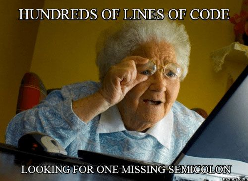
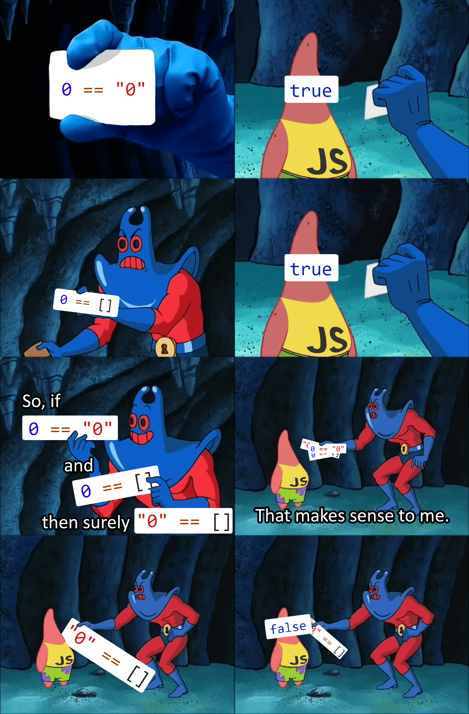
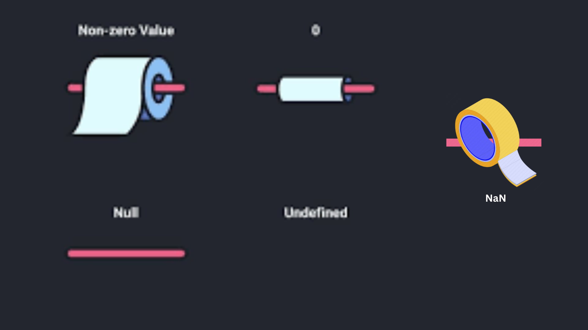
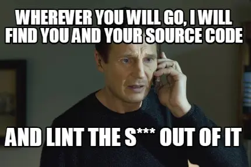
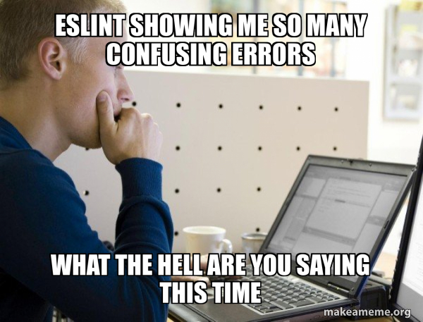
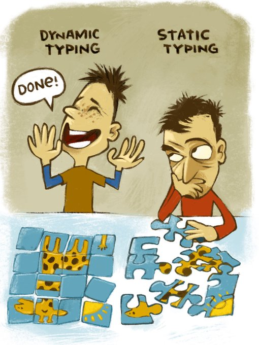

# JavaScript Weired Part and Best Practices #


Lets see some silent(suprise) errors which  do not trigger any kind of reporting, but fail in runtime and how can we mitigate ?

## ASI Automatic insert of semicolons ##

ASI is a feature of JavaScript that automatically inserts a semicolon at the end of a line if it is missing. This can lead to unexpected behavior in your code, and is generally considered a bad practice. 
It is recommended to always include semicolons at the end of your lines to avoid any issues.


``` javascript repl+
function getValue() {
    return
    {
        value: 1
    };
}

console.log(getValue()); // Expected: { value: 1 }, Actual: undefined
```

explain:
Automatic Semicolon Insertion (ASI): JavaScript automatically inserts a semicolon after the return statement.
Effect: The function effectively becomes:<pre>function getValue() { return; // ASI inserts a semicolon here { value: 1 }; } </pre>
Result: The function returns undefined because the return statement is terminated before the object is returned.

So we need to be careful about this and always include semicolons at the end of your lines to avoid any issues.



## use === instead == ##



== (Equality Operator):  
Compares two values for equality after converting both values to a common type (type coercion).

=== (Strict Equality Operator):
Compares two values for equality without converting them to a common type (no type coercion).

``` javascript repl+
console.log('0'==0); //true
console.log('0'===0); //false
console.log([]==0); //true because [] -> '' and 0 -> '' then compared
console.log([]===0); //false
console.log([]=='0'); //false because [] -> '' and then compared with '0'

```

Use === when you want to compare values without type conversion (recommended for most cases to avoid unexpected results).


## Undefined vs null vs NaN  ##



### undefined ###
Type: undefined
Meaning: A variable that has been declared but not assigned a value.
Usage: Indicates the absence of a value or that a variable has not been initialized.

``` javascript repl+
let a;
console.log(a); // Output: undefined

```

### null ###
Type: object
Meaning: An assignment value that represents no value or no object.
Usage: Explicitly indicates the absence of any object value.

``` javascript repl+
let b = null;
console.log(b); // Output: null
//typeof null --> Object 
```


NaN (Not-a-Number)
Type: number
Meaning: Represents a value that is not a legal number.
Usage: Typically the result of an invalid or undefined mathematical operation

``` javascript repl+
let result = 0 / 0;
console.log(result); // Output: NaN
console.log(typeof result); // Output: number
```

### Truthy vs Falsy ###

Values other than actual booleans can evaluate as true (truthy) or false (falsy) in a logical expression. The following values will be treated as falsy:


``` javascript repl+
if (false) console.log('false'); // false
if (0) console.log('0'); // false
if ('') console.log('empty string'); // false
if (null) console.log('null'); // false
if (undefined) console.log('undefined'); // false
if (NaN) console.log('NaN'); // false

//But 
if ({}) console.log('object'); // true
if ([]) console.log('array'); // true

```
usage : assign default value in Short Circuit evaluation ! 


### Short circuit evaluation ###

logical expression is not always a real boolean. 
Using || (or) - the first truthy or last value in the expression.
``` javascript repl+
let a = 0 || "default";
console.log(a); // Output: "default"
```
Using && (and) - Returns the first falsy value or the last value if none are falsy
``` javascript repl+
let b = 1 && "value";
console.log(b); // Output: "value"
```

Short circuit evaluation helps in writing concise and efficient code by avoiding unnecessary evaluations.


## Apply the use strict Directive ##

"use strict" is a directive in top js file that enables strict mode. Strict mode is a way to opt in to a restricted variant of JavaScript, 
which can help catch common coding errors and "unsafe" actions such as defining global variables. 

Here are some key points
-Eliminates some JavaScript silent errors by changing them to throw errors. 


``` javascript repl+

function f(){
'use strict';
 x=10; //x is not define 

}

f();


```

## Lint Code  ##

Earlier Strict gives support some extend, so it would be a nice to know about some potential error even before running the code. 

the process of analyzing code for potential errors, coding standard violations, and stylistic issues. A linter is a tool that performs this analysis and helps developers maintain consistent code quality.




There are many popular linters available for JavaScript, such as ESLint, JSHint, and JSLint. These tools can be integrated into your development workflow to catch errors early and enforce coding standards.



ESLint: A highly configurable linter that supports custom rules and plugins.
JSHint: Another popular linter that checks for potential errors and enforces coding conventions.
JSLint: A more opinionated linter created by Douglas Crockford, focusing on code quality and best practices.

JSLint is little agressive  and has fewer configuration options, while ESLint is highly configurable and supports custom rules and plugins. 


## Javascript is Dynamic Typing  ##

ariables do not have a fixed type and can hold values of any type at any time. 
This allows for flexibility but can also lead to unexpected behavior if not managed carefully.

``` javascript repl+

let variable = 42; // Initially a number
console.log(typeof variable); // Output: "number"

variable = "Hello, world!"; // Now a string
console.log(typeof variable); // Output: "string"

variable = true; // Now a boolean
console.log(typeof variable); // Output: "boolean"

```

TypeScript: Consider using TypeScript, a statically typed superset of JavaScript, to catch type-related errors at compile time.



## Typescript ##

pls refer : 


More Javascript Best practises : 
1. https://github.com/ryanmcdermott/clean-code-javascript
2. https://developer.mozilla.org/en-US/docs/Web/JavaScript/Guide
3. https://github.com/airbnb/javascript

[Back](https://github.com/parane/web-development/tree/javascript?tab=readme-ov-file#table-of-content)
