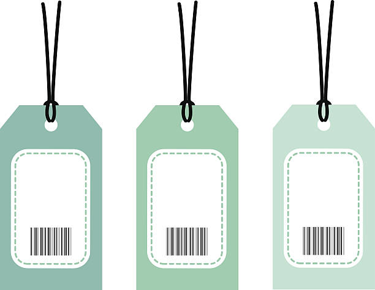

## Symbols 

In JavaScript, Symbols are a unique and immutable primitive data type introduced in ECMAScript 6 (ES6). They are primarily used to create unique property keys for objects, ensuring that no property keys will conflict, even if they have the same name.

### Creating Symbols

You can create a Symbol using the `Symbol()` function. Each time you call `Symbol()`, you will get a new, unique Symbol.

```javascript
const symbol1 = Symbol('foo');   
const symbol2 = Symbol('foo');

Symbol('foo') === Symbol('foo'); // false

```



> it is more like barcode, you can create multiple barcode with same name but they are unique. 


Symbols provide a powerful way to create unique identifiers for object properties, enabling better encapsulation and avoiding naming conflicts.
