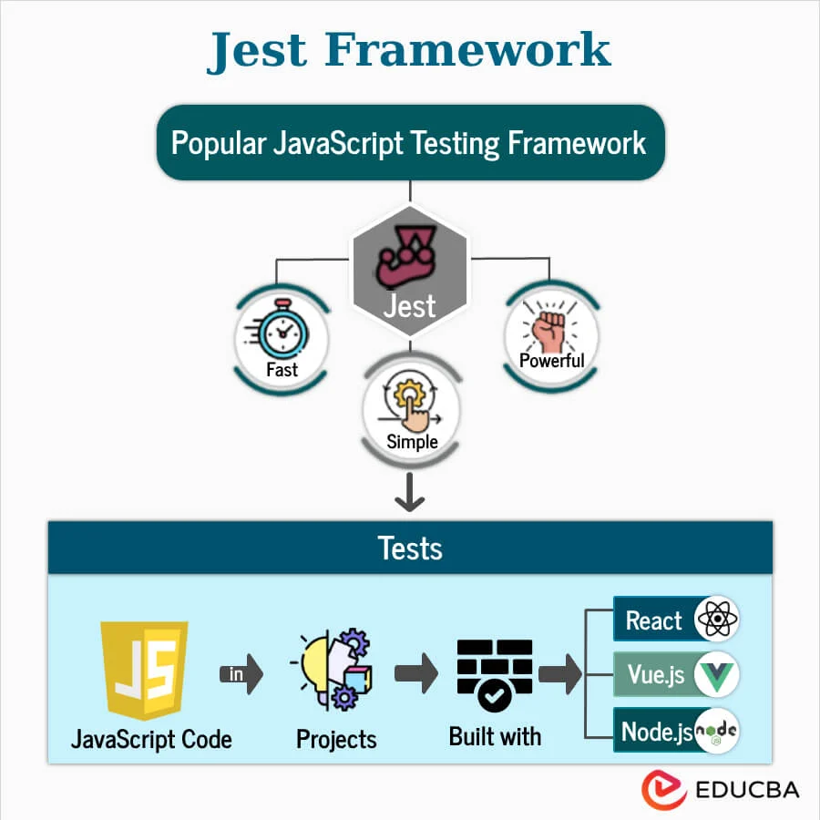
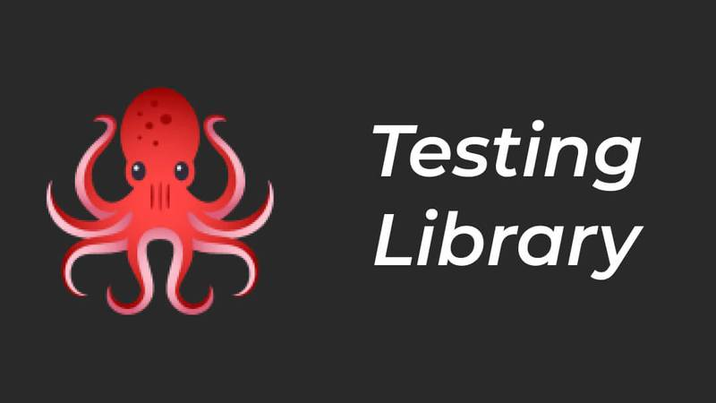

# Unit test

To set up unit testing for a Next.js and React application, you can use Jest and React Testing Library. Here are the steps to get started: 


## Recommended Tools: Jest 

[Jest](https://jestjs.io/) is a JavaScript testing framework that is commonly used for unit testing React applications. It provides a simple and intuitive API for writing tests and comes with built-in support for mocking, code coverage, and snapshot testing.


Jest is a JavaScript test runner that lets you access the DOM via JSdom. While JSdom is only an approximation of how the browser works, it is often good enough for testing React components. 

Jest is a popular testing framework that is commonly used with React applications. It provides a simple and intuitive API for writing tests and comes with built-in support for mocking, code coverage, and snapshot testing. Jest is also known for its fast test execution and parallel test running capabilities, making it a great choice for testing large codebases.

### Installation

To install Jest in your Next.js project, you can run the following command:

```bash
npm install --save-dev jest @testing-library/react @testing-library/jest-dom @testing-library/user-event
```

2. Configure Jest

Create a jest.config.js file in the root of your project:

```js
module.exports = {
  testEnvironment: 'jsdom',
  setupFilesAfterEnv: ['<rootDir>/jest.setup.js'],
  moduleNameMapper: {
    '\\.(css|less|scss|sass)$': 'identity-obj-proxy',
  },
};
```

3. Setup Testing Library
Create a jest.setup.js file in the root of your project:


```jsx
import '@testing-library/jest-dom/extend-expect';
```

4.  Write a Test
Create a test file for a component, for example, components/Home.test.js:

```js
import { render, screen } from '@testing-library/react';
import Home from './Home';

describe('Home', () => {
  it('renders the home page', () => {
    render(<Home />);
    expect(screen.getByText('Home Page')).toBeInTheDocument();
  });
});

```

5 Run Tests

Add a test script to your package.json:
```json

"scripts": {
  "test": "jest"
}
```

Run the tests using the following command:

```bash 
npm test
```


## Recommended Tools: React Testing Libraries


React Testing Library builds on top of DOM Testing Library by adding APIs for working with React components.

[React Testing Library](https://testing-library.com/docs/react-testing-library/intro/) is a set of utilities for testing React components. It provides a simple and intuitive API for interacting with components in a way that simulates how users would interact with them. React Testing Library encourages writing tests that focus on the behavior of the component rather than its implementation details, resulting in more robust and maintainable tests.

Key Features:
User-centric: Tests are written from the perspective of the user, ensuring that the component behaves as expected in real-world scenarios.
Lightweight: Provides a simple API that integrates well with Jest and other testing frameworks.
Encourages Best Practices: Promotes writing maintainable tests by avoiding reliance on implementation details.


### Example usage
Here's a simple example of how to use React Testing Library to test a React component:

```jsx

import { render, screen } from '@testing-library/react';
import '@testing-library/jest-dom/extend-expect';
import Home from './Home';

test('renders the home page', () => {
  render(<Home />);
  expect(screen.getByText('Home Page')).toBeInTheDocument();
});
```

In this example, we're testing the Home component by rendering it and then using the screen object to assert that the text 'Home Page' is present in the component. The expect function is used to make assertions about the component's behavior, such as whether certain elements are present or have specific attributes.