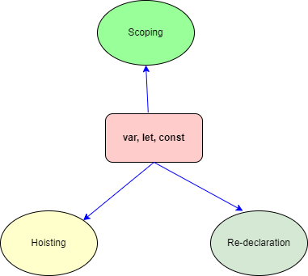
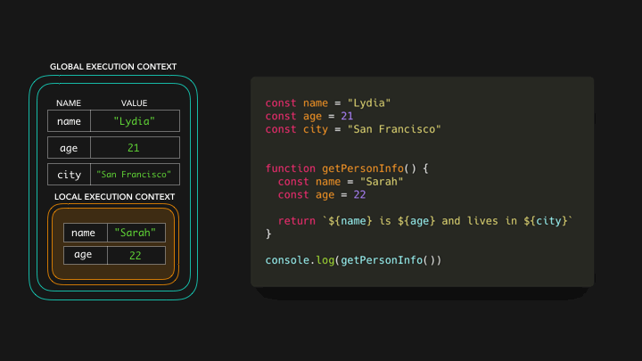
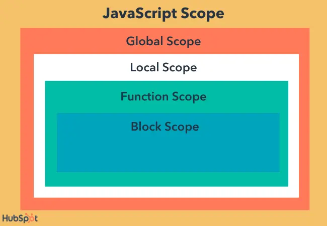
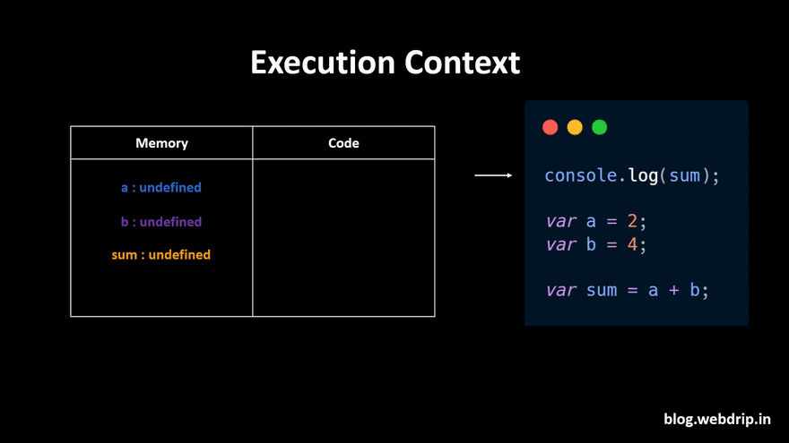

# Var, Let and Const #

In JavaScript, variables can be declared using `var`, `let`, or `const` keywords. 

let and const are the new alternatives (ES6) to the messy var old declearation 

Each of these keywords has different :




### Scoping ### 
At its core, scope in JavaScript refers to the context or environment in which variables are declared and can be accessed.

It dictates the visibility and lifetime of a variable, determining where in your code a particular variable is valid and accessible


```javascript
// Global Scope
var theater = "Global Theater";

function stagePlay() {
    // Function Scope
    let scene = "Act 1";

    if (true) {
        // Block Scope
        const actor = "John Doe";
        console.log(actor); // Output: John Doe
    }

    // actor is not accessible here
    // console.log(actor); // Uncaught ReferenceError: actor is not defined

    console.log(scene); // Output: Act 1
}

stagePlay();
console.log(theater); // Output: Global Theater
```




### javascript Scope ###



### Hoisting ### 


Hoisting is a JavaScript mechanism where variables and function declarations are moved to the top of their containing scope before code execution.
This means that no matter where functions and variables are declared, they are moved to the top of their scope regardless of whether their scope is global or local.


```javascript
// Imagine a play where actors are introduced at the beginning
console.log(actor); // Output: undefined (actor is introduced but not yet acting)
var actor = "John Doe"; // Now the actor starts acting

// Function hoisting
introduceActor(); // Output: "Hello, I am John Doe"
function introduceActor() {
  console.log("Hello, I am John Doe");
}
```

In the example above, the `actor` variable is hoisted to the top of the scope. This means that the variable is available before it is declared. The same is true for the `introduceActor` function.

Hoisting




## Var ##
**Scope**: Function-scoped.

**Hoisting**: Variables declared with var are hoisted to the top of their scope and initialized with undefined.

**Re-declaration**: Allowed within the same scope.


## Let ## 
**Scope** : Block-scoped.

**Hoisting**: Variables declared with let are hoisted but not initialized. Accessing them before declaration results in a ReferenceError.

**Re-declaration**: Not allowed within the same scope.


## Const ## 
**Scope**: Block-scoped.

**Hoisting**: Variables declared with const are hoisted but not initialized. 
Accessing them before declaration results in a ReferenceError.

**Re-declaration**: Not allowed within the same scope.
Assignment: Must be initialized at the time of declaration and cannot be reassigned.


we may play with [script/var.md](https://github.com/parane/web-development/blob/javascript/var-let-const/script/var.md)

[Back](https://github.com/parane/web-development/tree/javascript?tab=readme-ov-file#table-of-content)